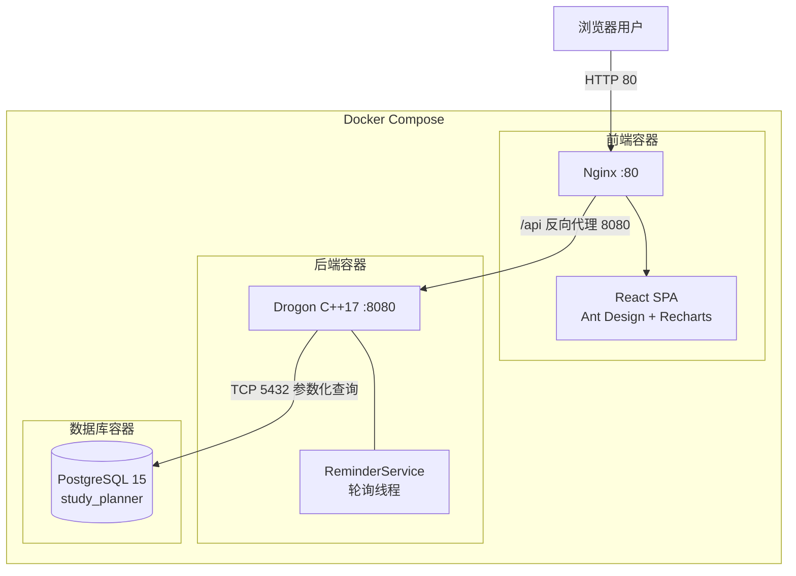
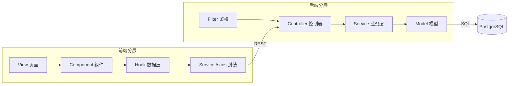
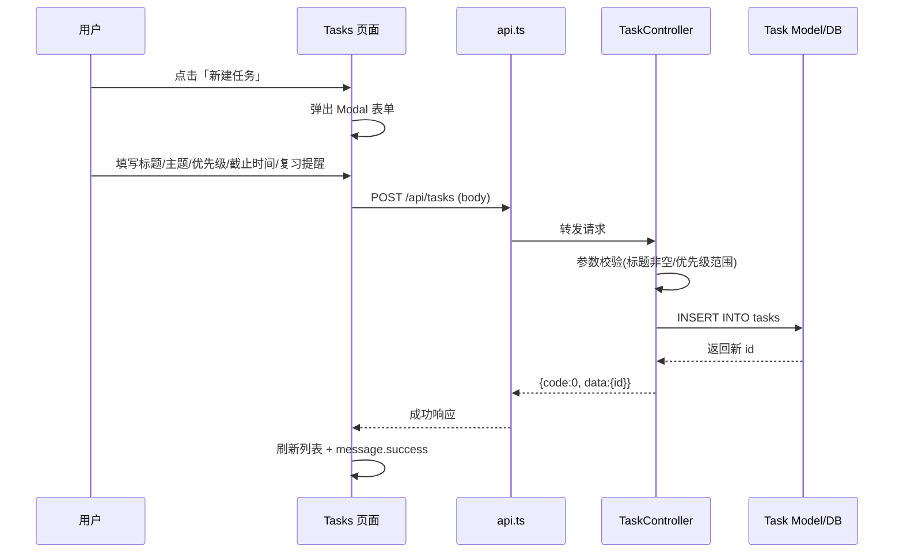
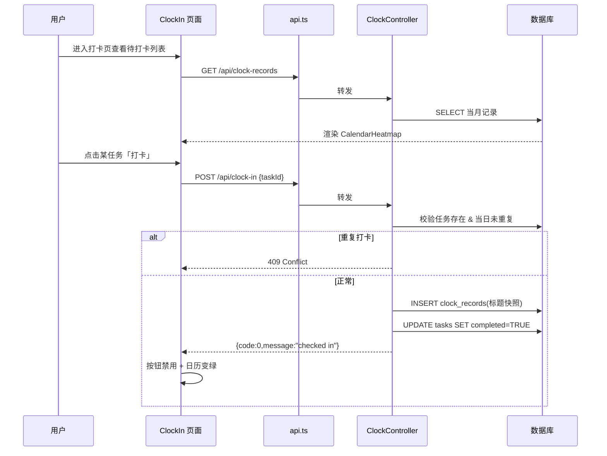
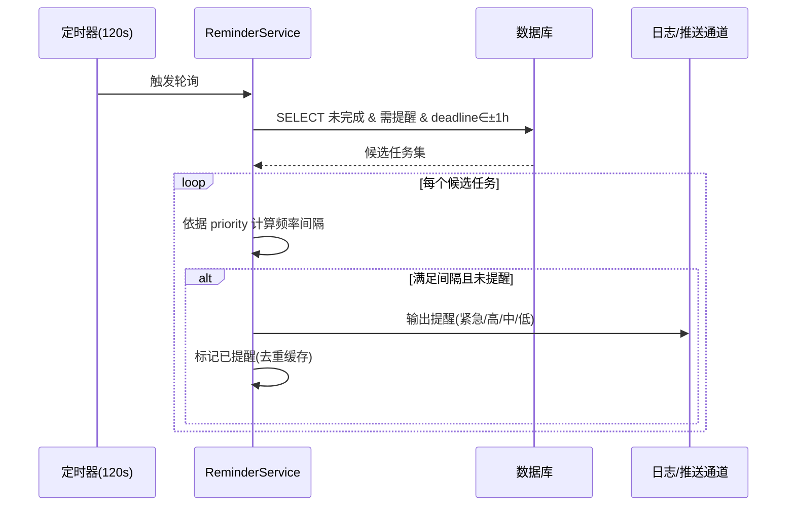
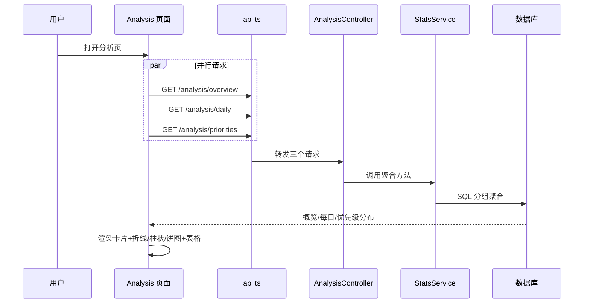
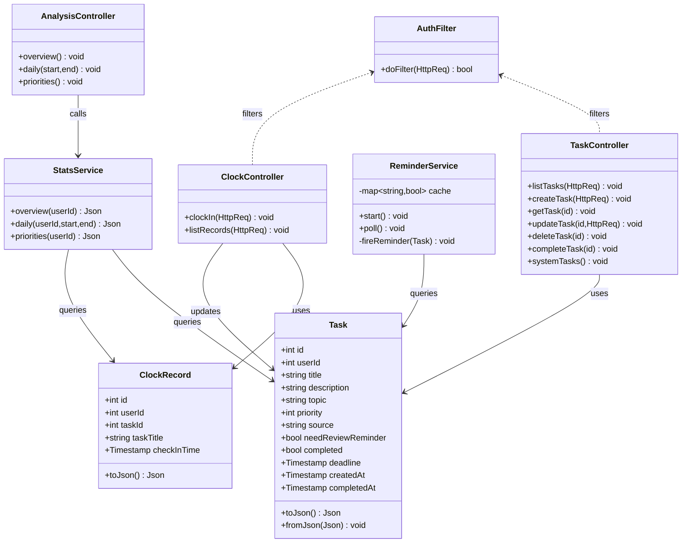
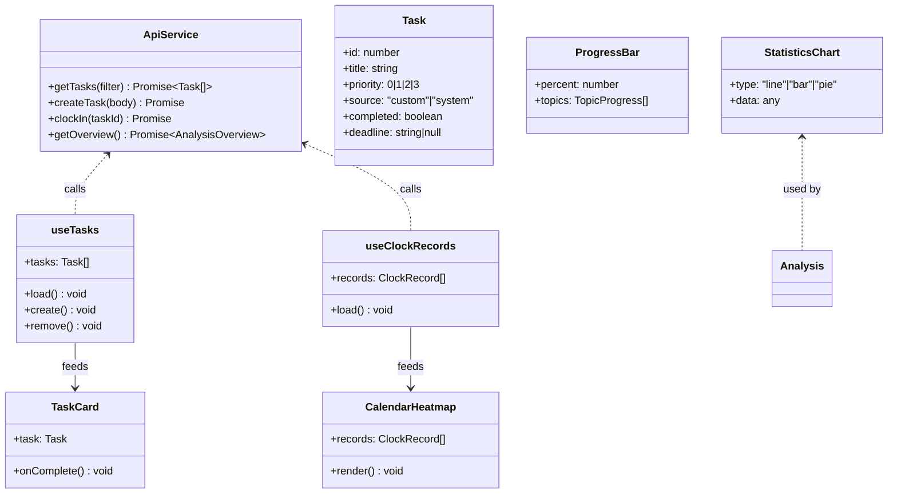

# 学习养成计划 — 系统设计说明书

版本 1.0 | 2026-07

> 本文档依据课程作业要求，包含以下八个部分：
> 1. 系统体系架构　2. 系统功能结构（层次结构）　3. 系统用例的时序图及说明
> 4. 复杂功能的算法设计（流程图 + 伪码）　5. 面向对象方法类图的详细设计
> 6. 接口设计　7. 数据库物理设计　8. UI（界面）设计

---

## 1. 系统体系架构

### 1.1 架构风格

系统采用 **B/S 架构 + 前后端分离**，整体以 Docker Compose 编排。前端为 React 单页应用（SPA），经 Nginx 提供静态资源并反向代理 `/api`；后端基于 Drogon（C++17）提供 RESTful API；数据持久化于 PostgreSQL 15。

### 1.2 部署体系架构图



### 1.3 软件分层架构



**分层职责**
- **前端**：View 负责页面布局，Component 负责展示，Hook 管理状态，Service 封装 API 调用。
- **后端 Controller**：解析请求、参数校验、封装 `{code,data,message}` 响应。
- **后端 Service**：实现业务规则（提醒策略、统计聚合、打卡去重），与 HTTP 解耦。
- **后端 Model**：与数据库字段一一对应的数据结构及 JSON 序列化。
- **Filter**：横切鉴权（当前默认 user_id=1，规划 JWT）。

---

## 2. 系统功能结构（层次结构）

系统功能按「模块 → 子功能 → 功能点」三级层次组织：

```mermaid
flowchart TD
    Root[学习养成计划系统] --> M1[学习任务模块]
    Root --> M2[任务提醒模块]
    Root --> M3[打卡任务模块]
    Root --> M4[数据展示模块]
    Root --> M5[任务分析模块]
    Root --> M6[系统基础]

    M1 --> M1a[自定义任务创建]
    M1 --> M1b[系统推荐任务]
    M1 --> M1c[任务属性设置\n主题/完成时间/优先级/复习提醒]
    M1 --> M1d[任务 CRUD]

    M2 --> M2a[差异化提醒\n按优先级+剩余时间]
    M2 --> M2b[复习提醒\n遗忘曲线(规划)]

    M3 --> M3a[任务打卡]
    M3 --> M3b[打卡记录查询]

    M4 --> M4a[进度条展示]
    M4 --> M4b[统计表展示]
    M4 --> M4c[打卡日历展示]

    M5 --> M5a[任务添加统计]
    M5 --> M5b[完成率统计]
    M5 --> M5c[优先级分布分析]

    M6 --> M6a[侧边栏导航]
    M6 --> M6b[API 服务]
```

---

## 3. 系统用例的时序图（顺序图）及说明

### 3.1 用例一：创建自定义任务



**说明**：用户在任务页点击新建，填写属性后提交；前端经 Axios 调用后端，Controller 完成校验后由 Model 写入数据库，返回新任务 ID，前端刷新列表并提示成功。

### 3.2 用例二：任务打卡



**说明**：打卡前先拉取当月记录渲染日历；打卡时后端校验任务存在性和当日唯一性，防止重复打卡（409），成功后插入打卡记录并将任务标记完成，前端更新视图。

### 3.3 用例三：差异化提醒（后台轮询）



**说明**：ReminderService 每 120 秒被定时器唤醒，查询临近截止且开启复习提醒的未完成任务，按优先级采用不同提醒频率（紧急每轮、高每2轮、中每6轮、低每12轮），并通过去重缓存避免重复提醒。

### 3.4 用例四：任务统计分析



**说明**：分析页并发请求三类统计接口，后端 StatsService 使用 SQL 聚合分别计算总体概览、每日趋势与优先级分布，前端以图表和明细表综合呈现。

---

## 4. 复杂功能的算法设计

### 4.1 差异化提醒算法

**流程图**

```mermaid
flowchart TD
    A[定时器每120s触发] --> B[查询候选任务\ncompleted=FALSE\nneed_review_reminder=TRUE\ndeadline∈(NOW-1h, NOW+1h)]
    B --> C{候选集为空?}
    C -->|是| Z[结束]
    C -->|否| D[取下一任务 t]
    D --> E[interval = map(t.priority)\n3→1,2→2,1→6,0→12]
    E --> F{pollCount % interval == 0\n且 !reminded(t.id,batch)?}
    F -->|否| G{还有任务?}
    F -->|是| H[触发提醒\n日志/推送]
    H --> I[标记 reminded(t.id,batch)]
    I --> G
    G -->|是| D
    G -->|否| Z
```

**伪码**

```
REMINDER_INTERVAL = {3:1, 2:2, 1:6, 0:12}
remindedCache = {}   // key: taskId_batch

procedure pollReminder(pollCount):
    candidates = SQL(
        "SELECT id, priority, title, deadline FROM tasks
         WHERE completed=FALSE AND need_review_reminder=TRUE
           AND deadline BETWEEN NOW()-INTERVAL '1h' AND NOW()+INTERVAL '1h'")
    for t in candidates:
        interval = REMINDER_INTERVAL[t.priority]
        key = t.id + "_" + batchId(pollCount)
        if pollCount % interval == 0 and key not in remindedCache:
            fireReminder(t)            // 当前输出日志，未来: 邮件/WebSocket
            remindedCache.add(key)
```

### 4.2 完成率与每日统计聚合算法

**流程图**

```mermaid
flowchart TD
    A[接收统计请求 start,end] --> B[overview: 聚合总任务/已完成]
    B --> C[completionRate = completed/total*100\n(total=0 则 0)]
    A --> D[daily: 按 DATE 分组]
    D --> E[added = COUNT(created_at)]
    D --> F[completed = COUNT(completed_at)]
    E --> G[rate = completed/(added+completed)*100]
    A --> H[priorities: 按 priority 分组 COUNT]
    C --> I[返回 JSON]
    G --> I
    H --> I
```

**伪码**

```
procedure analyzeOverview(userId):
    total     = SQL("SELECT COUNT(*) FROM tasks WHERE user_id=$1")
    completed = SQL("SELECT COUNT(*) FROM tasks WHERE user_id=$1 AND completed=TRUE")
    rate      = total==0 ? 0 : completed/total*100
    topicDist = SQL("SELECT topic, COUNT(*) ... GROUP BY topic")
    topicRate = SQL("SELECT topic, COUNT(*) FILTER(completed) ... GROUP BY topic")
    return {totalTasks, completed, pending, completionRate, topicDist, topicRate}

procedure analyzeDaily(userId, start, end):
    added     = SQL("SELECT DATE(created_at) d, COUNT(*) FROM tasks
                     WHERE user_id=$1 AND created_at BETWEEN $2 AND $3 GROUP BY d")
    completed = SQL("SELECT DATE(completed_at) d, COUNT(*) FROM tasks
                     WHERE user_id=$1 AND completed_at BETWEEN $2 AND $3 GROUP BY d")
    for each date: rate = completed/(added+completed)*100
    return dailyList

procedure analyzePriorities(userId):
    return SQL("SELECT priority, COUNT(*) FROM tasks WHERE user_id=$1 GROUP BY priority")
```

### 4.3 打卡去重算法

```
procedure clockIn(userId, taskId, today):
    if taskId is null: return 400
    task = SQL("SELECT * FROM tasks WHERE id=$1 AND user_id=$2")
    if task is null: return 404
    exist = SQL("SELECT 1 FROM clock_records
                 WHERE task_id=$1 AND user_id=$2 AND DATE(check_in_time)=$3")
    if exist: return 409
    SQL("INSERT INTO clock_records(user_id,task_id,task_title,check_in_time)
         VALUES($1,$2,$3,NOW())")
    SQL("UPDATE tasks SET completed=TRUE, completed_at=NOW() WHERE id=$1")
    return 0
```

---

## 5. 面向对象方法类图的详细设计

### 5.1 后端类图（C++/Drogon）



**说明**
- `Task` / `ClockRecord` 为实体模型，提供 JSON 序列化。
- 三个 Controller 分别处理任务、打卡、分析请求，依赖对应 Model 与 Service。
- `StatsService` 聚合查询 Task 与 ClockRecord；`ReminderService` 轮询 Task。
- `AuthFilter` 作为横切过滤器作用于 Controller（规划 JWT）。

### 5.2 前端关键类/组件关系



---

## 6. 接口设计

### 6.1 通用响应

```json
{ "code": 0, "data": { } }          // 成功
{ "code": 400, "message": "..." }   // 失败
```

### 6.2 接口一览

| 方法   | 端点                            | 请求                                            | 说明           |
| ------ | ------------------------------- | ----------------------------------------------- | -------------- |
| GET    | `/api/tasks`                    | Query: `topic/priority/source/completed`        | 任务列表       |
| POST   | `/api/tasks`                    | `{title,description?,topic?,priority?,needReviewReminder?,deadline?}` | 创建任务 |
| GET    | `/api/tasks/{id}`               | —                                               | 单个任务       |
| PUT    | `/api/tasks/{id}`               | `{title?,description?,topic?,priority?,completed?}` | 更新任务  |
| DELETE | `/api/tasks/{id}`               | —                                               | 删除任务       |
| PUT    | `/api/tasks/{id}/complete`      | —                                               | 完成任务       |
| GET    | `/api/tasks/system`             | —                                               | 系统推荐任务   |
| POST   | `/api/clock-in`                 | `{taskId}`                                       | 打卡签到       |
| GET    | `/api/clock-records`            | Query: `taskId/date`                             | 打卡记录       |
| GET    | `/api/analysis/overview`        | —                                               | 总体概览       |
| GET    | `/api/analysis/daily`           | Query: `start/end`                               | 每日统计       |
| GET    | `/api/analysis/priorities`      | —                                               | 优先级分布     |
| GET    | `/api/health`                   | —                                               | 健康检查       |

### 6.3 错误码

| code  | 含义         | 场景                         |
| ----- | ------------ | ---------------------------- |
| 0     | 成功         | —                            |
| 400   | 参数错误     | 缺 taskId / JSON 格式错误    |
| 401   | 未授权       | 缺 Token（鉴权启用后）       |
| 404   | 资源不存在   | 任务 / 记录不存在            |
| 409   | 资源冲突     | 重复打卡                     |
| 422   | 校验失败     | 标题超长 / 优先级越界        |
| 500   | 服务器错误   | 数据库异常                   |

---

## 7. 数据库物理设计

### 7.1 表结构（PostgreSQL 15）

| 表             | 字段                 | 类型              | 约束 / 索引                                  |
| -------------- | -------------------- | ----------------- | -------------------------------------------- |
| users          | id                   | SERIAL            | PK                                           |
|                | username             | VARCHAR(100)      | UNIQUE NOT NULL                              |
|                | password             | VARCHAR(255)      | NOT NULL                                     |
|                | created_at           | TIMESTAMP         | DEFAULT NOW()                                |
| tasks          | id                   | SERIAL            | PK                                           |
|                | user_id              | INTEGER           | FK→users NOT NULL  `idx_tasks_user_id`       |
|                | title                | VARCHAR(255)      | NOT NULL                                     |
|                | description          | TEXT              | DEFAULT ''                                   |
|                | topic                | VARCHAR(100)      | DEFAULT ''  `idx_tasks_topic`                |
|                | priority             | INTEGER           | DEFAULT 1, CHECK 0–3                         |
|                | source               | VARCHAR(20)       | DEFAULT 'custom', CHECK IN ('custom','system')|
|                | need_review_reminder | BOOLEAN           | DEFAULT FALSE                                |
|                | completed            | BOOLEAN           | DEFAULT FALSE  `idx_tasks_completed`         |
|                | deadline             | TIMESTAMP         | NULL  `idx_tasks_deadline`                   |
|                | created_at           | TIMESTAMP         | DEFAULT NOW()                                |
|                | completed_at         | TIMESTAMP         | NULL                                         |
| clock_records  | id                   | SERIAL            | PK                                           |
|                | user_id              | INTEGER           | FK→users NOT NULL  `idx_clock_user_date(user_id,check_in_time)` |
|                | task_id              | INTEGER           | FK→tasks NOT NULL  `idx_clock_task_id`       |
|                | task_title           | VARCHAR(255)      | NOT NULL                                     |
|                | check_in_time        | TIMESTAMP         | DEFAULT NOW()                                |

### 7.2 建表语句（节选）

```sql
CREATE TABLE tasks (
    id SERIAL PRIMARY KEY,
    user_id INTEGER NOT NULL REFERENCES users(id) ON DELETE CASCADE,
    title VARCHAR(255) NOT NULL,
    description TEXT DEFAULT '',
    topic VARCHAR(100) DEFAULT '',
    priority INTEGER DEFAULT 1 CHECK (priority BETWEEN 0 AND 3),
    source VARCHAR(20) DEFAULT 'custom' CHECK (source IN ('custom','system')),
    need_review_reminder BOOLEAN DEFAULT FALSE,
    completed BOOLEAN DEFAULT FALSE,
    deadline TIMESTAMP,
    created_at TIMESTAMP DEFAULT NOW(),
    completed_at TIMESTAMP
);
CREATE INDEX idx_tasks_user_id ON tasks(user_id);
CREATE INDEX idx_tasks_deadline ON tasks(deadline);

CREATE TABLE clock_records (
    id SERIAL PRIMARY KEY,
    user_id INTEGER NOT NULL REFERENCES users(id) ON DELETE CASCADE,
    task_id INTEGER NOT NULL REFERENCES tasks(id) ON DELETE CASCADE,
    task_title VARCHAR(255) NOT NULL,
    check_in_time TIMESTAMP DEFAULT NOW()
);
CREATE INDEX idx_clock_user_date ON clock_records(user_id, check_in_time);
```

### 7.3 物理设计要点

- **存储引擎**：PostgreSQL 默认堆表；所有查询使用参数化占位符 `$1,$2` 防注入。
- **索引策略**：高频过滤列（user_id/topic/completed/deadline）建单列索引；打卡日历按 `(user_id, check_in_time)` 复合索引加速按月查询。
- **外键级联**：用户删除级联删除其任务与打卡记录；任务删除级联打卡记录（打卡标题快照仍保留在记录中）。

---

## 8. UI（界面）设计

### 8.1 总体布局（侧边栏 + 内容区）

```
┌──────────────┬──────────────────────────────────────────┐
│   📚 学习养成│  内容区 (路由切换)                        │
│  ─────────── │  ────────────────────────────────────    │
│  ▸ 仪表盘     │                                          │
│  ▸ 任务管理   │                                          │
│  ▸ 打卡签到   │      （当前页面内容）                     │
│  ▸ 任务分析   │                                          │
│              │                                          │
└──────────────┴──────────────────────────────────────────┘
        Sider (Ant Design Menu)          Content
```

### 8.2 仪表盘（/）

```
┌────────────────────────────────────────────────────────┐
│  总任务 12   已完成 8   待完成 4   完成率 66.7%          │  ← Statistic 卡片
├────────────────────────────────────────────────────────┤
│  总体进度  [████████████░░░░░░░░] 66.7%                 │  ← ProgressBar
│  编程  [█████████░░] 80%   英语 [██░░] 33%  数学 [▌]50% │
├──────────────────────────┬─────────────────────────────┤
│  每日趋势 (折线图)        │   主题分布 (饼图)            │
│  新增/完成/完成率 三条线   │   编程/英语/数学 占比        │
└──────────────────────────┴─────────────────────────────┘
```

### 8.3 任务管理（/tasks）

```
┌────────────────────────────────────────────────────────┐
│ [+ 新建任务]   筛选: 主题[▾] 优先级[▾] 来源[▾] 状态[▾]    │
├────────────────────────────────────────────────────────┤
│ ┌─ 卡片: 编程练习                          [紧急][逾期] │
│ │ 描述: LeetCode 每日一题                   [完成][删除]│
│ └───────────────────────────────────────────────────── │
│ ┌─ 卡片: 英语单词                          [中][即将到期]│
│ │ ...                                                  │
│ └───────────────────────────────────────────────────── │
├────────────────────────────────────────────────────────┤
│ 系统推荐任务 (一键添加)                                 │
│ [+ 每日英语单词背诵] [+ 编程练习] [+ 阅读技术文章] ...    │
└────────────────────────────────────────────────────────┘

新建任务弹窗 (Modal + Form):
   标题* [________________]   主题 [________]
   优先级 ( )低(绿)( )中(蓝)( )高(橙)( )紧急(红)
   截止时间 [2026-07-10 📅]
   复习提醒 [开关]
   [取消]  [提交]
```

### 8.4 打卡签到（/clock-in）

```
┌────────────────────────┬────────────────────────────────┐
│ 待打卡任务              │  打卡日历 (2026-07)             │
│ ┌────────────────────┐ │  一 二 三 四 五 六 日           │
│ │ 编程练习   [打卡]   │ │  1  2  3● 4  5  6  7            │
│ └────────────────────┘ │  8  9 10 11●12 13 14           │
│ ┌────────────────────┐ │  15 16 17 18 19 20 21          │
│ │ 数学题     [已打卡] │ │  ●=已打卡  蓝圈=今天             │
│ └────────────────────┘ │  ‹ 切换月份 ›                   │
│ ...                    │                                │
└────────────────────────┴────────────────────────────────┘
```

### 8.5 任务分析（/analysis）

```
┌────────────────────────────────────────────────────────┐
│  总任务 12  已完成 8  待完成 4  完成率 66.7%             │
├──────────────────────────┬─────────────────────────────┤
│  每日趋势 (折线)          │  每日对比 (柱状: 新增 vs 完成)│
├──────────────────────────┴─────────────────────────────┤
│  优先级分布 (饼图)                                      │
├────────────────────────────────────────────────────────┤
│  主题完成率表          | 日期 | 新增 | 完成 | 完成率 |    │
│                       | 07-01|  2  |  1  |  50%   |    │
│  (Ant Design Table, 可排序)                             │
└────────────────────────────────────────────────────────┘
```

### 8.6 界面设计原则

- **组件库**：Ant Design 5 统一视觉；优先级以颜色标识（绿/蓝/橙/红）。
- **即将到期/逾期**：截止时间 <24h 显示橙色「即将到期」，已过期显示红色「已逾期」。
- **图表**：Recharts 响应式容器 + Tooltip；日历绿色标记已打卡日期。
- **反馈**：所有写操作返回 `message.success/error` 提示，后端异常时前端友好报错不白屏。

---

*文档结束*
