# 学习养成计划 — 系统设计说明书
---

## 1. 系统体系架构

### 1.1 架构风格

系统采用 **B/S 架构 + 前后端分离**，整体以 Docker Compose 编排。前端为 React 单页应用（SPA），经 Nginx 提供静态资源并反向代理 `/api`；后端基于 Drogon（C++17）提供 RESTful API；数据持久化于 PostgreSQL 15。

### 1.2 部署体系架构图

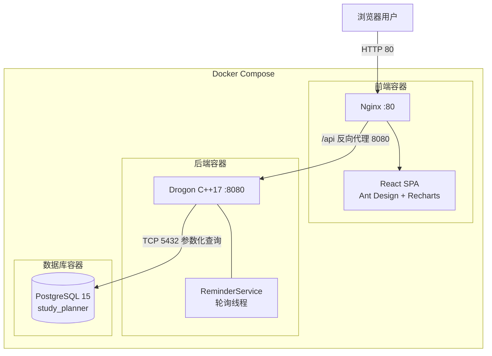

### 1.3 软件分层架构

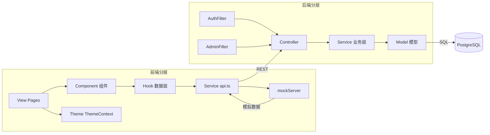

**分层职责**
- **前端**：View 负责页面路由布局，Component 负责展示，Hook 管理状态，Service 封装 API 调用（支持 mockServer 切换）。
- **后端 Controller**：Task / Clock / Analysis / Auth / Admin / Reminder，解析请求、参数校验、封装 `{code,data,message}` 响应。
- **后端 Service**：ReminderService（轮询提醒）、StatsService（统计聚合），与 HTTP 解耦。
- **后端 Model**：Task / ClockRecord，与数据库字段一一对应并提供 JSON 序列化。
- **Filter**：横切鉴权（AuthFilter Bearer Token 会话校验、AdminFilter 角色校验）。

---

## 2. 系统功能结构（层次结构）

系统功能按「模块 → 子功能 → 功能点」三级层次组织：

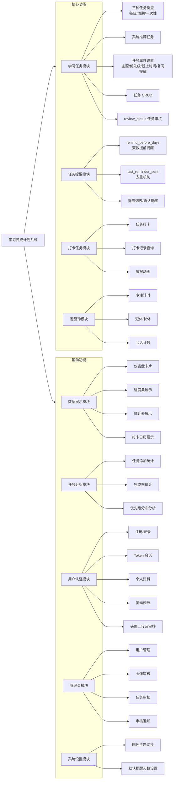

---

## 3. 系统用例的时序图（顺序图）及说明

### 3.1 用例一：创建自定义任务

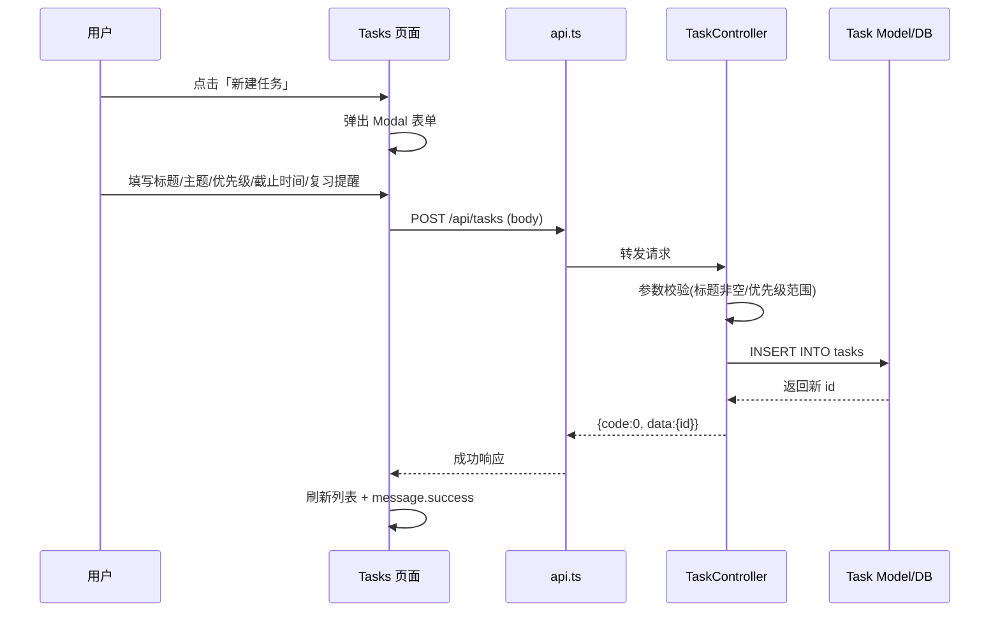

**说明**：用户在任务页点击新建，填写属性后提交；前端经 Axios 调用后端，Controller 完成校验后由 Model 写入数据库，返回新任务 ID，前端刷新列表并提示成功。

### 3.2 用例二：任务打卡

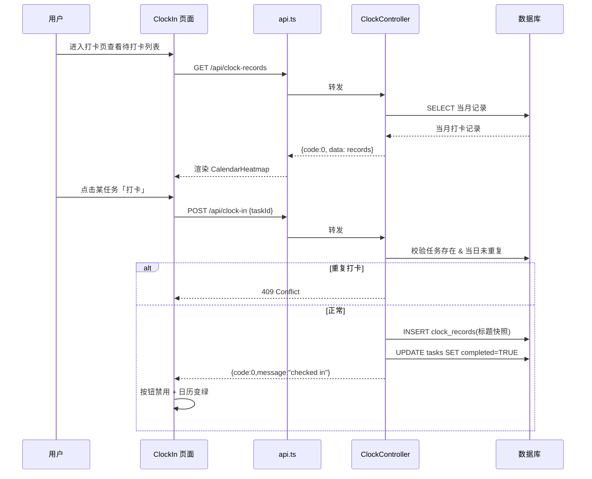

**说明**：打卡前先拉取当月记录渲染日历；打卡时后端校验任务存在性和当日唯一性，防止重复打卡（409），成功后插入打卡记录并将任务标记完成，前端更新视图。

### 3.3 用例三：差异化提醒（后台轮询）

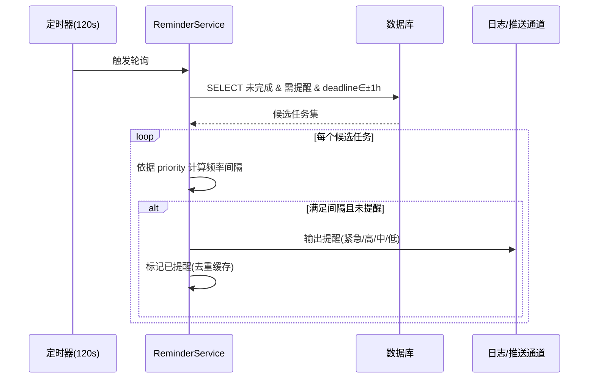

**说明**：ReminderService 每 120 秒被定时器唤醒，查询临近截止且开启复习提醒的未完成任务，按优先级采用不同提醒频率（紧急每轮、高每2轮、中每6轮、低每12轮），并通过去重缓存避免重复提醒。

### 3.4 用例四：任务统计分析

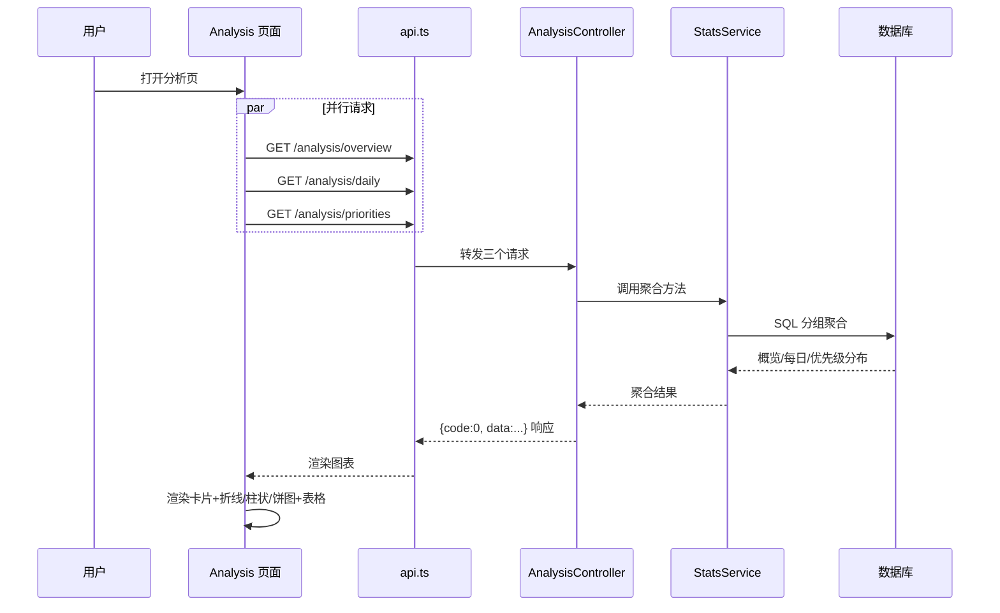

**说明**：分析页并发请求三类统计接口，后端 StatsService 使用 SQL 聚合分别计算总体概览、每日趋势与优先级分布，前端以图表和明细表综合呈现。

**`/analysis/overview` 响应示例**

```json
{
  "code": 0,
  "data": {
    "totalTasks": 12,
    "completed": 8,
    "pending": 4,
    "completionRate": 66.7,
    "topicDist": [{"topic":"编程","count":5}],
    "topicRate": [{"topic":"编程","completed":4,"rate":80}]
  }
}
```

---

## 4. 复杂功能的算法设计

### 4.1 差异化提醒算法

**流程图**

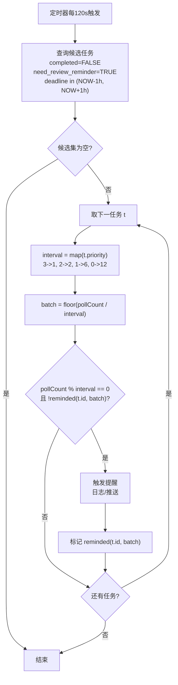

**伪码**

```
// 优先级 → 提醒轮次间隔映射表
//   紧急(3)每轮提醒, 高(2)每2轮, 中(1)每6轮, 低(0)每12轮
REMINDER_INTERVAL = {3:1, 2:2, 1:6, 0:12}

// 已提醒缓存: key = taskId_batch
//   batch = floor(pollCount / 轮次窗口), 每个 batch 内对同一任务仅提醒一次
//   ⚠️ 当前为内存缓存, 重启会丢失（重启后 pollCount 重置为 0，可能导致短时间内对部分任务重复提醒）
//   TODO: 改用 Redis 或 DB 表持久化已提醒状态及 pollCount
remindedCache = {}

// pollReminder: 定时轮询提醒
// 输入: pollCount — 全局递增计数器, 每次轮询自增 1, 重启时从持久层恢复
// 输出: 调用 fireReminder 输出提醒日志 (未来: 邮件/WebSocket 推送)
procedure pollReminder(pollCount):
    // 1. 查询候选任务: 未完成 + 开启了复习提醒 + 截止时间在 ±1h 内
    candidates = SQL(
        "SELECT id, priority, title, deadline FROM tasks
         WHERE completed=FALSE AND need_review_reminder=TRUE
           AND deadline BETWEEN NOW()-INTERVAL '1h' AND NOW()+INTERVAL '1h'")

    // 2. 遍历每个候选任务, 按优先级决定是否触发提醒
    for t in candidates:
        interval = REMINDER_INTERVAL[t.priority]
        batch = floor(pollCount / interval)           // 当前轮次所属的 batch
        key = t.id + "_" + batch                     // cache key: taskId_batch

        // 条件: 当前轮次是该优先级的提醒轮次, 且本 batch 内尚未提醒
        if pollCount % interval == 0 and key not in remindedCache:
            fireReminder(t)                          // 输出提醒日志
            remindedCache.add(key)                   // 标记已提醒, 防重复
```

### 4.2 完成率与每日统计聚合算法

**流程图**

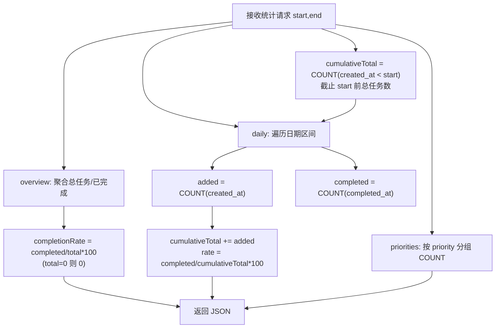

**伪码**

```
// analyzeOverview: 总体概览统计
// 输入: userId — 当前用户
// 返回: { totalTasks, completed, pending, completionRate, topicDist, topicRate }
procedure analyzeOverview(userId):
    // 1. 总任务数和已完成数
    totalTasks = SQL("SELECT COUNT(*) FROM tasks WHERE user_id=$1", userId)
    completed  = SQL("SELECT COUNT(*) FROM tasks WHERE user_id=$1 AND completed=TRUE",
                     userId)
    pending    = totalTasks - completed                          // 待完成数

    // 2. 完成率 (分母为 0 时返回 0)
    completionRate = totalTasks == 0 ? 0 : completed / totalTasks * 100

    // 3. 按主题分组统计: 各主题任务数
    //    bind: $1=userId
    topicDist = SQL("SELECT topic, COUNT(*) AS count FROM tasks
                     WHERE user_id=$1 GROUP BY topic ORDER BY count DESC", userId)

    // 4. 按主题分组统计: 各主题完成率
    //    bind: $1=userId
    topicRate = SQL("SELECT topic,
                            COUNT(*) FILTER (WHERE completed=TRUE) AS completed,
                            ROUND(COUNT(*) FILTER (WHERE completed=TRUE) * 100.0
                                  / COUNT(*), 1) AS rate
                     FROM tasks WHERE user_id=$1
                     GROUP BY topic ORDER BY rate DESC", userId)

    return { totalTasks, completed, pending, completionRate, topicDist, topicRate }


// analyzeDaily: 每日趋势统计
// 输入: userId, start(起始日期), end(截止日期)
// 返回: [{ date, added, completed, rate }]  按日期升序
procedure analyzeDaily(userId, start, end):
    // 1. 按创建日期统计每日新增任务数 (bind: $1=userId, $2=start, $3=end)
    addedRows = SQL("SELECT DATE(created_at) AS d, COUNT(*) AS cnt FROM tasks
                     WHERE user_id=$1 AND created_at BETWEEN $2 AND $3
                     GROUP BY d ORDER BY d", userId, start, end)

    // 2. 按完成日期统计每日完成任务数 (bind: $1=userId, $2=start, $3=end)
    completedRows = SQL("SELECT DATE(completed_at) AS d, COUNT(*) AS cnt FROM tasks
                         WHERE user_id=$1 AND completed_at BETWEEN $2 AND $3
                         GROUP BY d ORDER BY d", userId, start, end)

    // 3. 合并两结果集: 按日期归并, 计算每日完成率
    //    完成率 = 当日完成数 / (截止当日已存在的总任务数) * 100
    dailyList = []
    accTotal = SQL("SELECT COUNT(*) FROM tasks
                    WHERE user_id=$1 AND created_at < $2", userId, start)
    for each date in dateRange(start, end):
        added    = lookup(addedRows, date, default=0)
        compl    = lookup(completedRows, date, default=0)
        accTotal = accTotal + added
        rate     = accTotal == 0 ? 0 : ROUND(compl * 100.0 / accTotal, 1)
        dailyList.append({ date, added, completed: compl, rate })

    return dailyList


// analyzePriorities: 优先级分布统计
// 输入: userId — 当前用户
// 返回: [{ priority, count }]  按优先级分组
procedure analyzePriorities(userId):
    // bind: $1=userId
    return SQL("SELECT priority, COUNT(*) AS count FROM tasks
                WHERE user_id=$1 GROUP BY priority ORDER BY priority", userId)
```

### 4.3 打卡去重算法

```
// 打卡签到算法
// 输入: userId(当前用户), taskId(目标任务), today(打卡日期)
// 返回: 0=成功, HTTP状态码=错误
procedure clockIn(userId, taskId, today):
    // 1. 参数校验: taskId 不可为空
    if taskId is null:
        return 400                         // HTTP 400 Bad Request

    // 2. 查询任务是否存在, 同时校验归属 (bind: $1=taskId, $2=userId)
    task = SQL("SELECT id, title FROM tasks WHERE id=$1 AND user_id=$2",
               taskId, userId)
    if task is null:
        return 404                         // HTTP 404 Not Found

    // 3. 当日重复打卡检测 (bind: $1=taskId, $2=userId, $3=today)
    //    同一用户对同一任务每天只能打卡一次
    exist = SQL("SELECT 1 FROM clock_records
                 WHERE task_id=$1 AND user_id=$2 AND DATE(check_in_time)=$3",
                taskId, userId, today)
    if exist:
        return 409                         // HTTP 409 Conflict

    // 4. 写入打卡记录, 保存任务标题快照 (bind: $1=userId, $2=taskId, $3=task.title)
    //    标题快照确保即使任务后续被修改或删除, 打卡记录仍保留打卡时的标题
    SQL("INSERT INTO clock_records(user_id, task_id, task_title, check_in_time)
         VALUES($1, $2, $3, NOW())", userId, taskId, task.title)

    // 5. 将任务标记为已完成 (bind: $1=taskId)
    SQL("UPDATE tasks SET completed=TRUE, completed_at=NOW() WHERE id=$1", taskId)

    return 0                               // 成功
```

---

## 5. 面向对象方法类图的详细设计

### 5.1 后端类图（C++/Drogon）

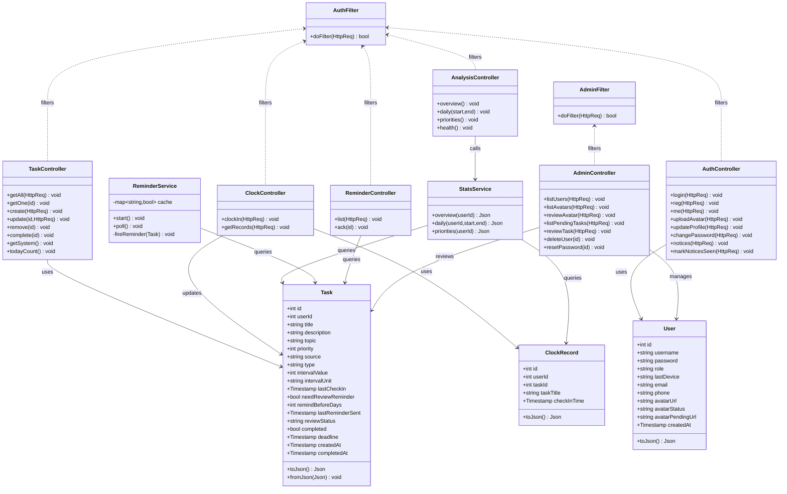

**说明**
- `Task` / `ClockRecord` / `User` 为实体模型，提供 JSON 序列化。
- 六个 Controller（Task / Clock / Analysis / Auth / Admin / Reminder）分别处理不同业务域，依赖对应 Model 与 Service。
- `StatsService` 聚合查询 Task 与 ClockRecord；`ReminderService` 轮询 Task 并写入 reminders 表；`ReminderController` 提供提醒列表查询与确认。
- `AuthFilter` 通过 Bearer Token 会话校验作用于所有需鉴权的 Controller；`AdminFilter` 额外校验 role='admin' 角色，仅作用于 AdminController。

### 5.2 前端关键类/组件关系

```mermaid
classDiagram
    class ApiService {
        +getTasks(filter) Promise~Task[]~
        +createTask(body) Promise
        +getTask(id) Promise~Task~
        +updateTask(id,body) Promise
        +deleteTask(id) Promise
        +completeTask(id) Promise
        +fetchSystemTasks() Promise~Task[]~
        +fetchTodayTaskCount() Promise~{count}~
        +clockIn(taskId) Promise
        +getRecords(filter) Promise~ClockRecord[]~
        +getOverview() Promise~AnalysisOverview~
        +getDaily(start,end) Promise~DailyStat[]~
        +getPriorities() Promise~PriorityDist[]~
        +fetchProfile() Promise~UserProfile~
        +updateProfile(data) Promise
        +changePassword(data) Promise
        +uploadAvatar(avatar) Promise
        +login(username,password) Promise
        +fetchNotices() Promise~ReviewNotice[]~
        +markNoticesSeen() Promise
        +fetchAdminUsers() Promise~AdminUser[]~
        +fetchPendingAvatars() Promise~PendingAvatar[]~
        +reviewAvatar(userId,action) Promise
        +fetchPendingTasks() Promise~PendingTask[]~
        +reviewTask(taskId,action) Promise
        +deleteUser(userId) Promise
        +resetUserPassword(userId) Promise
    }
    class useTasks {
        +tasks: Task[]
        +load() void
        +create() void
        +update(id,body) void
        +remove() void
    }
    class useClockRecords {
        +records: ClockRecord[]
        +load() void
    }
    class useIsMobile {
        +isMobile: boolean
    }
    class ThemeContext {
        +isDark: boolean
        +toggle() void
    }
    class Task {
        +id: number
        +title: string
        +priority: 0|1|2|3
        +source: "custom"|"system"
        +type: "once"|"daily"|"periodic"
        +completed: boolean
        +deadline: string|null
        +reviewStatus: string
    }
    class ClockRecord {
        +taskId: number
        +taskTitle: string
        +checkInTime: string
    }
    class TopicProgress {
        +topic: string
        +percent: number
    }
    class TaskCard {
        +task: Task
        +onComplete() void
    }
    class ProgressBar {
        +percent: number
        +topics: TopicProgress[]
    }
    class CalendarHeatmap {
        +records: ClockRecord[]
        +render() void
    }
    class AnalysisPage {
        +overview: AnalysisOverview
        +dailyStats: DailyStat[]
    }
    class StatisticsChart {
        +type: "line"|"bar"|"pie"
        +data: any
    }
    class Login {
        +handleSubmit() void
    }
    class Admin {
        +handleLogout() void
    }
    class Account
    class Settings
    class Achievements
    class Pomodoro
    class TrackingNav
    class CheckInSuccess
    class AdminPanel
    class UserProfile
    ApiService <.. useTasks : calls
    ApiService <.. useClockRecords : calls
    useTasks --> TaskCard : feeds
    useTasks --> CheckInSuccess : feeds
    useClockRecords --> CalendarHeatmap : feeds
    StatisticsChart <.. AnalysisPage : used by
    TrackingNav ..> useIsMobile : uses
    Login ..> ApiService : calls
    Admin ..> AdminPanel : renders
    Admin ..> ThemeContext : uses
    Account ..> UserProfile : renders
    Account ..> ApiService : calls
    Settings ..> ThemeContext : uses
```

---

## 6. 接口设计

### 6.1 通用响应

```json
{ "code": 0, "data": { } }          // 成功
{ "code": 400, "message": "..." }   // 失败
```

### 6.2 接口一览

| 方法   | 端点                            | 请求                                            | 说明           |
| --- | --- | --- | --- |
| POST | /api/auth/login | {username, password} | 登录 |
| POST | /api/auth/register | {username, password} | 注册 |
| GET | /api/auth/me | - | 当前用户资料 |
| POST | /api/auth/profile | {email?, phone?} | 更新资料 |
| POST | /api/auth/password | {oldPassword, newPassword} | 改密 |
| POST | /api/auth/avatar | {avatar: base64} | 上传头像 |
| GET | /api/auth/notices | - | 审核通知 |
| POST | /api/auth/notices/seen | - | 标记通知已读 |
| GET | /api/tasks | Query | 任务列表 |
| POST | /api/tasks | {title,...} | 创建任务 |
| GET | /api/tasks/{id} | - | 单个任务 |
| PUT | /api/tasks/{id} | {...} | 更新任务 |
| DELETE | /api/tasks/{id} | - | 删除任务 |
| PUT | /api/tasks/{id}/complete | - | 完成任务 |
| GET | /api/tasks/system | - | 系统推荐 |
| GET | /api/tasks/today-count | - | 今日数量 |
| POST | /api/clock-in | {taskId} | 打卡 |
| GET | /api/clock-records | Query | 打卡记录 |
| GET | /api/analysis/overview | - | 概览 |
| GET | /api/analysis/daily | Query | 每日统计 |
| GET | /api/analysis/priorities | - | 优先级 |
| GET | /api/health | - | 健康检查 |
| GET | /api/reminders | - | 提醒列表 |
| POST | /api/reminders/{id}/ack | - | 确认提醒 |
| GET | /api/admin/users | - | 用户列表 |
| DELETE | /api/admin/users/{id} | - | 删除用户 |
| POST | /api/admin/users/{id}/reset-password | - | 重置密码 |
| GET | /api/admin/avatars | - | 待审头像 |
| POST | /api/admin/avatars/review | {userId, action} | 审核头像 |
| GET | /api/admin/tasks/pending | - | 待审任务 |
| POST | /api/admin/tasks/review | {taskId, action} | 审核任务 |

### 6.3 错误码

| code  | 含义         | 场景                         |
| ----- | ------------ | ---------------------------- |
| 0     | 成功         | —                            |
| 400   | 参数错误     | 缺 taskId / JSON 格式错误    |
| 401   | 未授权       | 缺 Token（鉴权启用后）       |
| 404   | 资源不存在   | 任务 / 记录不存在            |
| 409   | 资源冲突     | 重复打卡                     |
| 422   | 校验失败     | 标题超长 / 优先级越界        |
| 500   | 服务器错误   | 数据库异常                   |

---

## 7. 数据库物理设计

### 7.1 实体关系图

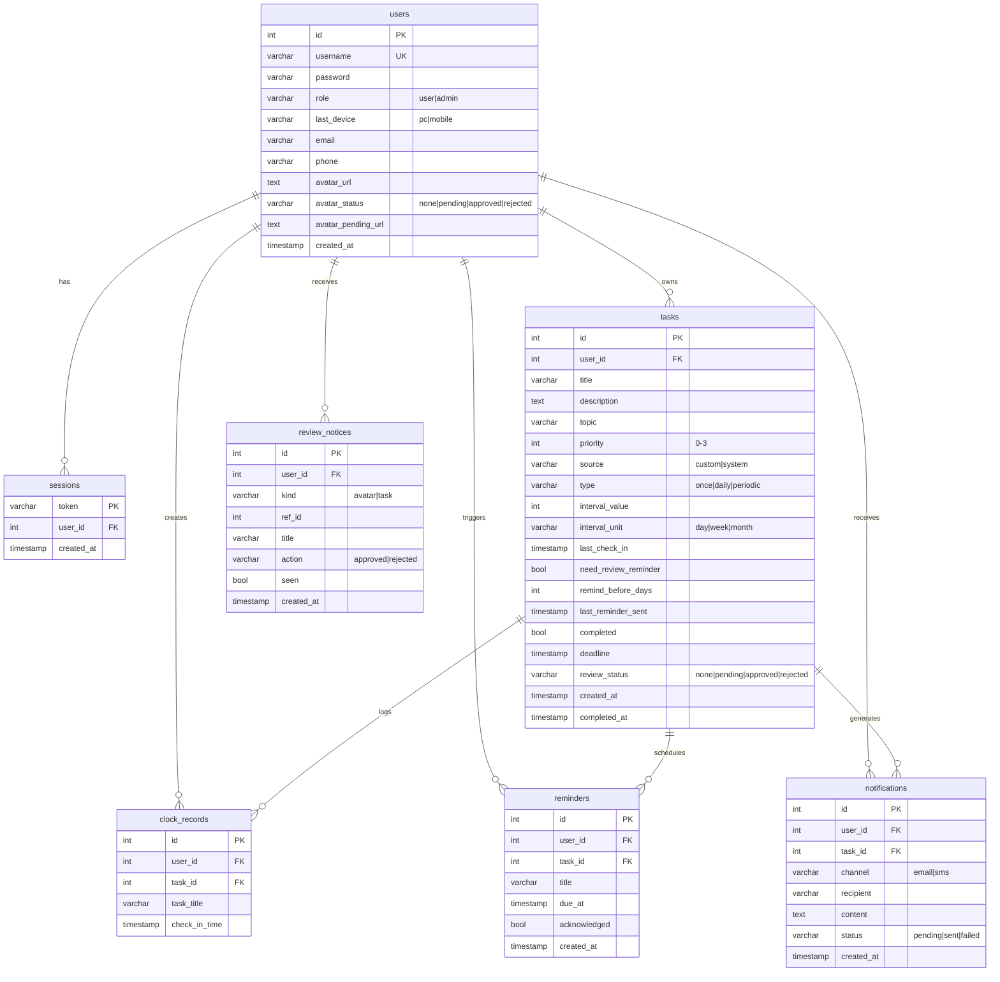

### 7.2 表结构（PostgreSQL 15）

| 表             | 字段                 | 类型              | 约束 / 索引                                  |
| -------------- | -------------------- | ----------------- | -------------------------------------------- |
| users          | id                   | SERIAL            | PK                                           |
|                | username             | VARCHAR(100)      | UNIQUE NOT NULL                              |
|                | password             | VARCHAR(255)      | NOT NULL                                     |
|                | role                 | VARCHAR(20)       | DEFAULT 'user', CHECK IN ('user','admin')    |
|                | last_device          | VARCHAR(10)       | DEFAULT 'pc', CHECK IN ('pc','mobile')       |
|                | email                | VARCHAR(255)      | NULL                                         |
|                | phone                | VARCHAR(50)       | NULL                                         |
|                | avatar_url           | TEXT              | NULL                                         |
|                | avatar_status        | VARCHAR(20)       | DEFAULT 'none', CHECK IN ('none','pending','approved','rejected') |
|                | avatar_pending_url   | TEXT              | NULL                                         |
|                | created_at           | TIMESTAMP         | DEFAULT NOW()                                |
| sessions       | token                | VARCHAR(64)       | PK                                           |
|                | user_id              | INTEGER           | FK→users NOT NULL  `idx_sessions_user`       |
|                | created_at           | TIMESTAMP         | DEFAULT NOW()                                |
| tasks          | id                   | SERIAL            | PK                                           |
|                | user_id              | INTEGER           | FK→users NOT NULL  `idx_tasks_user_id`       |
|                | title                | VARCHAR(255)      | NOT NULL                                     |
|                | description          | TEXT              | DEFAULT ''                                   |
|                | topic                | VARCHAR(100)      | DEFAULT ''  `idx_tasks_topic`                |
|                | priority             | INTEGER           | DEFAULT 1, CHECK 0–3                         |
|                | source               | VARCHAR(20)       | DEFAULT 'custom', CHECK IN ('custom','system')|
|                | type                 | VARCHAR(20)       | DEFAULT 'once', CHECK IN ('once','daily','periodic') |
|                | interval_value       | INTEGER           | DEFAULT 1                                    |
|                | interval_unit        | VARCHAR(10)       | DEFAULT 'day', CHECK IN ('day','week','month') |
|                | last_check_in        | TIMESTAMP         | NULL                                         |
|                | need_review_reminder | BOOLEAN           | DEFAULT FALSE                                |
|                | remind_before_days   | INTEGER           | NULL                                         |
|                | last_reminder_sent   | TIMESTAMP         | NULL                                         |
|                | completed            | BOOLEAN           | DEFAULT FALSE  `idx_tasks_completed`         |
|                | deadline             | TIMESTAMP         | NULL  `idx_tasks_deadline`                   |
|                | review_status        | VARCHAR(20)       | DEFAULT 'none', CHECK IN ('none','pending','approved','rejected') |
|                | created_at           | TIMESTAMP         | DEFAULT NOW()                                |
|                | completed_at         | TIMESTAMP         | NULL                                         |
| clock_records  | id                   | SERIAL            | PK                                           |
|                | user_id              | INTEGER           | FK→users NOT NULL  `idx_clock_user_date(user_id,check_in_time)` |
|                | task_id              | INTEGER           | FK→tasks ON DELETE SET NULL  `idx_clock_task_id` |
|                | task_title           | VARCHAR(255)      | NOT NULL                                     |
|                | check_in_time        | TIMESTAMP         | DEFAULT NOW()                                |
| reminders      | id                   | SERIAL            | PK                                           |
|                | user_id              | INTEGER           | FK→users NOT NULL  `idx_reminders_user`      |
|                | task_id              | INTEGER           | FK→tasks ON DELETE CASCADE                   |
|                | title                | VARCHAR(255)      | NOT NULL                                     |
|                | due_at               | TIMESTAMP         | NOT NULL  `idx_reminders_due`                |
|                | acknowledged         | BOOLEAN           | DEFAULT FALSE                                |
|                | created_at           | TIMESTAMP         | DEFAULT NOW()                                |
| notifications  | id                   | SERIAL            | PK                                           |
|                | user_id              | INTEGER           | FK→users NOT NULL  `idx_notifications_user`  |
|                | task_id              | INTEGER           | FK→tasks ON DELETE SET NULL                  |
|                | channel              | VARCHAR(10)       | NOT NULL, CHECK IN ('email','sms')           |
|                | recipient            | VARCHAR(255)      | NOT NULL                                     |
|                | content              | TEXT              | NULL                                         |
|                | status               | VARCHAR(20)       | DEFAULT 'sent', CHECK IN ('pending','sent','failed') |
|                | created_at           | TIMESTAMP         | DEFAULT NOW()                                |
| review_notices | id                   | SERIAL            | PK                                           |
|                | user_id              | INTEGER           | FK→users NOT NULL  `idx_review_notices_user` |
|                | kind                 | VARCHAR(20)       | NOT NULL, CHECK IN ('avatar','task')         |
|                | ref_id               | INTEGER           | NULL                                         |
|                | title                | VARCHAR(255)      | DEFAULT ''                                   |
|                | action               | VARCHAR(20)       | NOT NULL, CHECK IN ('approved','rejected')   |
|                | seen                 | BOOLEAN           | DEFAULT FALSE  `idx_review_notices_unseen(user_id,seen)` |
|                | created_at           | TIMESTAMP         | DEFAULT NOW()                                |

### 7.3 建表语句（完整）

```sql
CREATE TABLE users (
    id            SERIAL PRIMARY KEY,
    username      VARCHAR(100) UNIQUE NOT NULL,
    password      VARCHAR(255) NOT NULL,
    role          VARCHAR(20) DEFAULT 'user' CHECK (role IN ('user', 'admin')),
    last_device   VARCHAR(10) DEFAULT 'pc' CHECK (last_device IN ('pc', 'mobile')),
    created_at    TIMESTAMP DEFAULT NOW(),
    avatar_url    TEXT,
    avatar_status VARCHAR(20) DEFAULT 'none' CHECK (avatar_status IN ('none','pending','approved','rejected')),
    avatar_pending_url TEXT,
    email         VARCHAR(255),
    phone         VARCHAR(50)
);

CREATE TABLE sessions (
    token       VARCHAR(64) PRIMARY KEY,
    user_id     INTEGER NOT NULL REFERENCES users(id) ON DELETE CASCADE,
    created_at  TIMESTAMP DEFAULT NOW()
);
CREATE INDEX idx_sessions_user ON sessions(user_id);

CREATE TABLE tasks (
    id                    SERIAL PRIMARY KEY,
    user_id               INTEGER NOT NULL REFERENCES users(id) ON DELETE CASCADE,
    title                 VARCHAR(255) NOT NULL,
    description           TEXT DEFAULT '',
    topic                 VARCHAR(100) DEFAULT '',
    priority              INTEGER DEFAULT 1 CHECK (priority BETWEEN 0 AND 3),
    source                VARCHAR(20) DEFAULT 'custom' CHECK (source IN ('custom','system')),
    type                  VARCHAR(20) DEFAULT 'once' CHECK (type IN ('once','daily','periodic')),
    interval_value        INTEGER DEFAULT 1,
    interval_unit         VARCHAR(10) DEFAULT 'day' CHECK (interval_unit IN ('day','week','month')),
    last_check_in         TIMESTAMP,
    need_review_reminder  BOOLEAN DEFAULT FALSE,
    remind_before_days    INTEGER,
    last_reminder_sent    TIMESTAMP,
    completed             BOOLEAN DEFAULT FALSE,
    deadline              TIMESTAMP,
    review_status         VARCHAR(20) DEFAULT 'none' CHECK (review_status IN ('none','pending','approved','rejected')),
    created_at            TIMESTAMP DEFAULT NOW(),
    completed_at          TIMESTAMP
);
CREATE INDEX idx_tasks_user_id ON tasks(user_id);
CREATE INDEX idx_tasks_topic ON tasks(topic);
CREATE INDEX idx_tasks_completed ON tasks(completed);
CREATE INDEX idx_tasks_deadline ON tasks(deadline);

CREATE TABLE clock_records (
    id              SERIAL PRIMARY KEY,
    user_id         INTEGER NOT NULL REFERENCES users(id) ON DELETE CASCADE,
    task_id         INTEGER REFERENCES tasks(id) ON DELETE SET NULL,
    task_title      VARCHAR(255) NOT NULL,
    check_in_time   TIMESTAMP DEFAULT NOW()
);
CREATE UNIQUE INDEX uk_clock_task_date ON clock_records(COALESCE(task_id, 0), user_id, DATE(check_in_time));
CREATE INDEX idx_clock_user_date ON clock_records(user_id, check_in_time);
CREATE INDEX idx_clock_task_id ON clock_records(task_id);

CREATE TABLE reminders (
    id           SERIAL PRIMARY KEY,
    user_id      INTEGER NOT NULL REFERENCES users(id) ON DELETE CASCADE,
    task_id      INTEGER REFERENCES tasks(id) ON DELETE CASCADE,
    title        VARCHAR(255) NOT NULL,
    due_at       TIMESTAMP NOT NULL,
    acknowledged BOOLEAN DEFAULT FALSE,
    created_at   TIMESTAMP DEFAULT NOW(),
    UNIQUE (task_id, due_at)
);
CREATE INDEX idx_reminders_user ON reminders(user_id);
CREATE INDEX idx_reminders_due ON reminders(due_at);

-- 提醒发送记录：PC 端走邮件(email)，移动端走短信(sms)
CREATE TABLE notifications (
    id         SERIAL PRIMARY KEY,
    user_id    INTEGER NOT NULL REFERENCES users(id) ON DELETE CASCADE,
    task_id    INTEGER REFERENCES tasks(id) ON DELETE SET NULL,
    channel    VARCHAR(10) NOT NULL CHECK (channel IN ('email', 'sms')),
    recipient  VARCHAR(255) NOT NULL,
    content    TEXT,
    status     VARCHAR(20) DEFAULT 'sent' CHECK (status IN ('pending', 'sent', 'failed')),
    created_at TIMESTAMP DEFAULT NOW()
);
CREATE INDEX idx_notifications_user ON notifications(user_id);

-- 审核结果通知：管理员审核（头像/任务）后，被审核的普通用户下次登录时弹出结果
CREATE TABLE review_notices (
    id         SERIAL PRIMARY KEY,
    user_id    INTEGER NOT NULL REFERENCES users(id) ON DELETE CASCADE,
    kind       VARCHAR(20) NOT NULL CHECK (kind IN ('avatar', 'task')),
    ref_id     INTEGER,
    title      VARCHAR(255) NOT NULL DEFAULT '',
    action     VARCHAR(20) NOT NULL CHECK (action IN ('approved', 'rejected')),
    seen       BOOLEAN DEFAULT FALSE,
    created_at TIMESTAMP DEFAULT NOW()
);
CREATE INDEX idx_review_notices_user ON review_notices(user_id);
CREATE INDEX idx_review_notices_unseen ON review_notices(user_id, seen);
```

### 7.4 物理设计要点

- **存储引擎**：PostgreSQL 默认堆表；所有查询使用参数化占位符 `$1,$2` 防注入。
- **索引策略**：高频过滤列（user_id/topic/completed/deadline）建单列索引；打卡日历按 `(user_id, check_in_time)` 复合索引加速按月查询；提醒按 `due_at` 索引加速轮询；未读审核通知按 `(user_id, seen)` 覆盖索引加速查询。
- **外键级联**：用户删除级联删除其任务、打卡、会话、提醒、通知；任务删除时打卡记录保留（task_id 置为 NULL，标题快照仍可查阅）。

---

## 8. UI（界面）设计

### 8.1 总体布局（侧边栏 + 内容区）

```
┌──────────────┬──────────────────────────────────────────┐
│   学习养成    │  内容区 (路由切换)                        │
│  ─────────── │  ────────────────────────────────────    │
│  ▸ 仪表盘     │                                          │
│  ▸ 任务管理   │                                          │
│  ▸ 打卡签到   │      (当前页面内容)                       │
│  ▸ 任务分析   │                                          │
│              │                                          │
└──────────────┴──────────────────────────────────────────┘
        Sider (Ant Design Menu)          Content
```

### 8.2 仪表盘（/）

```
┌────────────────────────────────────────────────────────┐
│  总任务 12   已完成 8   待完成 4   完成率 66.7%          │  ← Statistic 卡片
├────────────────────────────────────────────────────────┤
│  总体进度  [████████████░░░░░░░░] 66.7%                 │  ← ProgressBar
│  编程  [█████████░░] 80%   英语 [██░░] 33%  数学 [▌]50% │
├──────────────────────────┬─────────────────────────────┤
│  每日趋势 (折线图)        │   主题分布 (饼图)            │
│  新增/完成/完成率 三条线   │   编程/英语/数学 占比        │
└──────────────────────────┴─────────────────────────────┘
```

### 8.3 任务管理（/tasks）

```
┌────────────────────────────────────────────────────────┐
│ [+ 新建任务]   筛选: 主题[▾] 优先级[▾] 来源[▾] 状态[▾]    │
├────────────────────────────────────────────────────────┤
│ ┌─ 卡片: 编程练习                          [紧急][逾期]  │
│ │ 描述: LeetCode 每日一题                   [完成][删除] │
│ └───────────────────────────────────────────────────── │
│ ┌─ 卡片: 英语单词                          [中][即将到期]│
│ │ ...                                                  │
│ └───────────────────────────────────────────────────── │
├────────────────────────────────────────────────────────┤
│ 系统推荐任务 (一键添加)                                  │
│ [+ 每日英语单词背诵] [+ 编程练习] [+ 阅读技术文章] ...    │
└────────────────────────────────────────────────────────┘

新建任务弹窗 (Modal + Form):
   标题* [________________]   主题 [________]
   优先级 ( )低(绿)( )中(蓝)( )高(橙)( )紧急(红)
   截止时间 [2026-07-10]
   复习提醒 [开关]
   [取消]  [提交]
```

### 8.4 打卡签到（/clock-in）

```
┌────────────────────────┬────────────────────────────────┐
│ 待打卡任务              │  打卡日历 (2026-07)             │
│ ┌────────────────────┐ │  一 二 三 四 五 六 日            │
│ │ 编程练习   [打卡]   │ │  1  2  3● 4  5  6  7           │
│ └────────────────────┘ │  8  9 10 11●12 13 14           │
│ ┌────────────────────┐ │  15 16 17 18 19 20 21          │
│ │ 数学题     [已打卡] │ │  ●=已打卡  蓝圈=今天             │
│ └────────────────────┘ │  ‹ 切换月份 ›                   │
│ ...                    │                                │
└────────────────────────┴────────────────────────────────┘
```

### 8.5 任务分析（/analysis）

```
┌────────────────────────────────────────────────────────┐
│  总任务 12  已完成 8  待完成 4  完成率 66.7%             │
├──────────────────────────┬─────────────────────────────┤
│  每日趋势 (折线)          │  每日对比 (柱状: 新增 vs 完成)│
├──────────────────────────┴─────────────────────────────┤
│  优先级分布 (饼图)                                      │
├────────────────────────────────────────────────────────┤
│  主题完成率表          | 日期 | 新增 | 完成 | 完成率 |    │
│                       | 07-01|  2  |  1  |  50%   |    │
│  (Ant Design Table, 可排序)                             │
└────────────────────────────────────────────────────────┘
```

### 8.6 登录/注册（/login）

```
┌────────────────────────────────────────────────────────┐
│                   学习养成计划                          │
├────────────────────────────────────────────────────────┤
│  ┌──────────────────────────────────────────────────┐  │
│  │  ┌──────────────┐  ┌──────────────┐              │  │
│  │  │    登录       │  │    注册       │              │  │
│  │  │ 用户名 [____] │  │ 用户名 [____] │              │  │
│  │  │ 密码   [____] │  │ 密码   [____] │              │  │
│  │  │ [登录]        │  │ 确认密码 [__] │              │  │
│  │  │               │  │ [注册管理员]  │              │  │
│  │  │               │  │ [创建账号]    │              │  │
│  │  └──────────────┘  └──────────────┘              │  │
│  │  ┌──────────────────────────────────────────────┐ │  │
│  │  │  荧光绿蒙版（左右滑动切换 登录/注册 面板）     │ │  │
│  │  │  "欢迎回来 / 你好，新同学！"                  │ │  │
│  │  └──────────────────────────────────────────────┘ │  │
│  └──────────────────────────────────────────────────┘  │
└────────────────────────────────────────────────────────┘
```

### 8.7 管理员面板（/admin）

```
┌────────────────────────────────────────────────────────┐
│  管理后台      用户名     [退出登录]  [🌙/☀ 主题切换]    │
├────────────────────────────────────────────────────────┤
│  ┌────────────────────────────────────────────────────┐│
│  │  用户管理  │  待审头像  │  待审任务  │  个人信息    ││  ← Tabs
│  ├────────────────────────────────────────────────────┤│
│  │  用户管理标签页:                                    ││
│  │  ┌─────┬────────┬──────┬──────────┬───────────┐   ││
│  │  │ ID  │ 用户名  │ 角色 │ 邮箱      │ 操作       │   ││
│  │  ├─────┼────────┼──────┼──────────┼───────────┤   ││
│  │  │ 1   │ admin  │ admin│ a@b.com  │ [重置密码] │   ││
│  │  │ 2   │ user1  │ user │ ...      │ [注销][重置]│   ││
│  │  └─────┴────────┴──────┴──────────┴───────────┘   ││
│  │  待审头像标签页:  头像预览  → [通过/拒绝]           ││
│  │  待审任务标签页:  任务详情  → [通过/拒绝]           ││
│  └────────────────────────────────────────────────────┘│
└────────────────────────────────────────────────────────┘
```

### 8.8 番茄钟（/pomodoro）

```
┌────────────────────────────────────────────────────────┐
│              🍅 番茄钟                                 │
│                                                        │
│              ┌──────────────┐                          │
│              │   25:00      │                          │
│              │   ◯ ◯ ◯ ◯   │  ← 会话计数（4个番茄）    │
│              │  [环形SVG进度条]                         │
│              │              │                          │
│              │  [开始] [重置]                          │
│              └──────────────┘                          │
│                                                        │
│              模式: [专注] [短休 5m] [长休 15m]          │
│                                                        │
│  ┌────────────────────────────────────────────────┐    │
│  │  完成一个番茄后推送到提醒列表，可进入短休/长休    │    │
│  └────────────────────────────────────────────────┘    │
└────────────────────────────────────────────────────────┘
```

### 8.9 个人设置（/settings）

```
┌────────────────────────────────────────────────────────┐
│  设置                                                    │
│                                                        │
│  ┌────────────────────────────────────────────────┐    │
│  │  主题设置                                        │    │
│  │  ☀ 浅色模式  /  🌙 暗色模式  [●────────○]       │    │
│  └────────────────────────────────────────────────┘    │
│  ┌────────────────────────────────────────────────┐    │
│  │  提醒设置                                        │    │
│  │  默认提前提醒天数: [ 1 ] 天                      │    │
│  └────────────────────────────────────────────────┘    │
└────────────────────────────────────────────────────────┘
```

### 8.10 个人中心（/account）

```
┌────────────────────────────────────────────────────────┐
│  个人中心                                                │
├────────────────────────────────────────────────────────┤
│  ┌────────────────────────────────────────────────┐    │
│  │  头像: [圆形头像]  [上传头像]                   │    │
│  │  用户名: zhang3                                 │    │
│  │  角色: 普通用户 / 管理员                        │    │
│  │  注册时间: 2026-07-01                          │    │
│  └────────────────────────────────────────────────┘    │
│  ┌────────────────────────────────────────────────┐    │
│  │  资料编辑                                         │    │
│  │  邮箱: z@example.com  [编辑]                    │    │
│  │  电话: 138xxxx1234  [编辑]                      │    │
│  └────────────────────────────────────────────────┘    │
│  ┌────────────────────────────────────────────────┐    │
│  │  安全设置                                        │    │
│  │  密码: ********  [修改密码]                     │    │
│  └────────────────────────────────────────────────┘    │
│  ┌────────────────────────────────────────────────┐    │
│  │  成就/成就墙  (Achievements 页面)              │    │
│  │  🏅 连续打卡7天  🏅 完成50个任务  ...          │    │
│  └────────────────────────────────────────────────┘    │
└────────────────────────────────────────────────────────┘
```

### 8.11 界面设计原则

- **组件库**：Ant Design 5 统一视觉；优先级以颜色标识（绿/蓝/橙/红）。
- **即将到期/逾期**：截止时间 <24h 显示橙色「即将到期」，已过期显示红色「已逾期」。
- **图表**：Recharts 响应式容器 + Tooltip；日历绿色标记已打卡日期。
- **反馈**：所有写操作返回 `message.success/error` 提示，后端异常时前端友好报错不白屏。

---

*文档结束*
