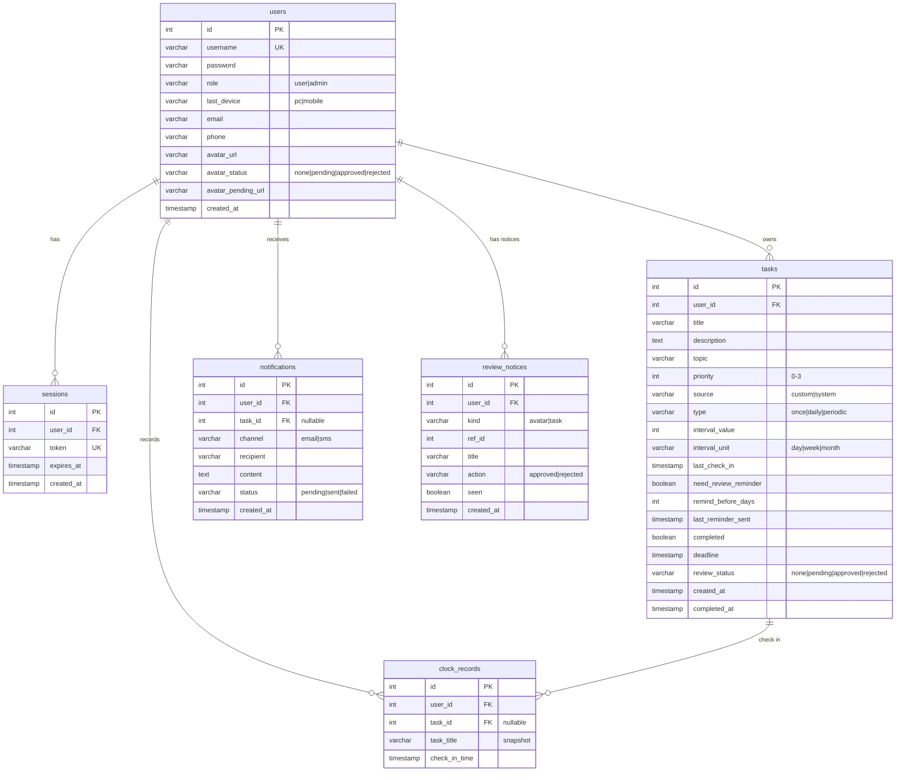

# 学习养成计划 — 需求规格说明书

版本 1.1 | 2026-07

---

## 修订记录

| 日期       | 版本 | 修订内容                                               | 作者       |
| ---------- | ---- | ------------------------------------------------------ | ---------- |
| 2026-07-06 | 1.0  | 初稿                                                   | 项目组     |
| 2026-07-07 | 1.1  | 新增架构图、数据流图、风险分析、错误码表、UI 交互描述、细化提醒策略、完善验收标准和术语表 | 项目组     |

---

## 1. 项目背景

### 1.1 现状分析

在当今快节奏的学习环境中，学生和自学者普遍面临以下问题：

- 学习任务分散在多个平台（备忘录、日历、纸质笔记），缺乏统一管理
- 缺乏有效的复习提醒机制，导致遗忘曲线作用显著
- 缺少可视化的学习进度反馈，难以维持长期学习动力
- 没有系统的数据分析来评估学习效率和改进方向

### 1.2 可行性

- **技术可行性**：团队熟练掌握 C++，选用 Drogon 框架作为后端可在充分发挥 C++ 性能优势的同时通过 RESTful API 与前端解耦；React + Ant Design 可快速搭建现代化的响应式界面
- **操作可行性**：Web 应用无需安装，浏览器访问即可使用
- **经济可行性**：使用开源技术栈（React、Drogon、PostgreSQL），部署在 Docker 容器中，成本可控

---

## 2. 项目目标

### 2.1 总体目标

开发一个学习养成计划软件，帮助用户添加、管理学习任务，提供提醒功能、复习提醒、任务分析和可视化图表展示，从而提升学习效率和持续性。

### 2.2 具体目标

1. 实现任务的增删改查，支持自定义和系统推荐两种来源
2. 提供基于优先级和截止时间的动态提醒功能
3. 实现打卡签到机制，记录用户每日学习执行情况
4. 通过进度条、统计表和打卡日历等形式直观展示数据
5. 对用户每日任务添加数和完成率进行统计分析

### 2.3 预期用户

- 在校学生（大学生、研究生）
- 自学者（编程、语言、职业资格考试等）
- 需要培养日常学习习惯的上班族

---
## 3. 用户角色

### 3.1 普通用户

- 创建和管理个人学习任务
- 查看系统推荐任务并一键添加
- 完成任务后打卡签到
- 查看个人学习进度和统计数据
- 设置复习提醒偏好

### 3.2 系统管理员
- 管理用户（查看列表、删除、重置密码）
- 审核用户头像（通过/拒绝，通知用户）
- 审核超额任务（普通用户日创建超30个时进入待审核）
- 查看审核通知（用户登录时弹出审核结果）

---
## 4. 系统架构

### 4.1 系统部署架构图

```
┌──────────────────────────────────────────────────────┐
│                    Docker Compose                    │
│                                                      │
│  ┌────────────────┐  ┌────────────────────────────┐  │
│  │  前端 (Nginx)  │  │      PostgreSQL 15         │  │
│  │  ┌──────────┐  │  │  ┌──────────────────────┐  │  │
│  │  │React SPA │  │  │  │   study_planner      │  │  │
│  │  │ (Vite)   │  │  │  │  - users             │  │  │
│  │  │Ant Design│  │  │  │  - tasks             │  │  │
│  │  │Recharts  │  │  │  │  - clock_records     │  │  │
│  │  │Axios/Dayj│  │  │  └──────────────────────┘  │  │
│  │  └────┬─────┘  │  └────────────┬───────────────┘  │
│  └───────┼────────┘               │                  │
│          │ HTTP (端口 80)          │ TCP (5432)       │
│          │                        │                  │
│  ┌───────┴────────────────────────┴───────────────┐  │
│  │             后端 （Drogon C++17）               │  │
│  │  ┌────────┐  ┌────────┐  ┌────────┐            │  │
│  │  │Control-│  │Services│  │Filters │            │  │
│  │  │ lers   │  │-Remind │  │- Auth  │            │  │
│  │  │- Task  │  │- Stats │  │        │            │  │
│  │  │- Clock │  │        │  │        │            │  │
│  │  │- Analys│  │        │  │        │            │  │
│  │  └────────┘  └────────┘  └────────┘            │  │
│  │  ┌──────────────────────────────────────────┐  │  │
│  │  │      Models (Task, ClockRecord)          │  │  │
│  │  └──────────────────────────────────────────┘  │  │
│  └────────────────────────────────────────────────┘  │
└──────────────────────────────────────────────────────┘
```

### 4.2 前端组件树

```
App (Layout: Sidebar + Content)
├── Login (/login)
│   ├── 登录面板 + 注册面板 (动画切换遮罩层)
│   └── 表单验证 (用户名2-10字符/密码4+)
├── Dashboard (/)
│   ├── StatisticCards (总任务数/完成数/完成率/待完成)
│   ├── ProgressBar (总体进度 + 各主题进度)
│   ├── StatisticsChart (每日趋势折线图)
│   └── StatisticsChart (主题分布饼图)
├── Tasks (/tasks)
│   ├── TaskCard[] (任务列表，支持筛选)
│   │   ├── 优先级色标 (绿/蓝/橙/红)
│   │   ├── 逾期/即将到期标记
│   │   └── 已完成状态 + 任务类型标签
│   ├── 新建/编辑弹窗 (Modal + Form, 含类型选择)
│   └── 系统推荐任务面板 (5种模板)
├── ClockIn (/clock-in)
│   ├── 待打卡任务列表 (TaskCard[] + 打卡按钮)
│   ├── CheckInSuccess (打卡成功庆祝动画)
│   └── CalendarHeatmap (打卡日历热力图, 按月切换)
├── Analysis (/analysis)
│   ├── StatisticCards
│   ├── StatisticsChart (每日趋势折线图)
│   ├── StatisticsChart (每日柱状对比图)
│   ├── StatisticsChart (主题分布饼图)
│   └── 主题完成率表格 + 30日明细表 (Ant Design Table)
├── Pomodoro (/pomodoro)
│   ├── SVG 环形倒计时
│   ├── 模式切换 (专注25min / 短休5min / 长休15min)
│   └── 会话计数器
├── Settings (/settings)
│   ├── 暗色/亮色主题切换 (Switch)
│   └── 默认提醒天数设置 (Slider)
├── Account (/account)
│   ├── 邮箱设置 (脱敏显示前3字符)
│   ├── 手机设置 (脱敏显示前3字符)
│   ├── 修改密码
│   └── 头像上传 (Base64 → 审核流程)
├── Achievements (/achievements)
│   └── 学习数据展示
└── Admin (/admin)
    ├── AdminPanel
    │   ├── 用户管理 (列表/删除/重置密码)
    │   ├── 头像审核 (待审核列表 → 通过/拒绝)
    │   └── 任务审核 (待审核列表 → 通过/拒绝)
```

### 4.3 数据流图

#### 打卡流程

```
用户 ──点击「打卡」──→ ClockIn 页面 ──POST /api/clock-in──→ ClockController
                                                              │
                                                              ├── 查询任务是否存在
                                                              ├── INSERT clock_records
                                                              └── UPDATE tasks SET completed=TRUE
                                                              │
                    CalendarHeatmap ◄── GET /api/clock-records ──┘
```

#### 提醒流程

```
ReminderService (独立线程, 每120s轮询)
    │
    ├── SELECT tasks WHERE completed=FALSE
    │       AND need_review_reminder=TRUE
    │       AND deadline BETWEEN NOW-1h AND NOW+1h
    │
    └── 对每个到期任务 ──→ 日志输出提醒信息
                              │
                          (未来扩展：邮件/WebSocket 推送)
```

#### 统计流程

```
Analysis 页面 ──→ 三个并行请求
    ├── GET /analysis/overview  ──→ StatsService: SQL 聚合任务/完成率/主题分布
    ├── GET /analysis/daily     ──→ StatsService: 按日分组聚合新增和完成数
    └── GET /analysis/priorities──→ StatsService: 按优先级分组计数
```

---

## 5. 功能需求

### 5.1 学习任务模块

#### FR-001 自定义任务

| 项目         | 内容                                             |
| ------------ | ------------------------------------------------ |
| 描述         | 用户可以自行创建学习任务，填写任务各项属性       |
| 前置条件     | 用户已登录系统                                   |
| 输入         | 标题（必填）、描述、主题、优先级、截止时间、复习提醒开关 |
| 处理流程     | 1. 用户点击「新建任务」→ 2. 弹出表单弹窗 → 3. 填写各项属性 → 4. 提交 → 5. 后端校验 → 6. 写入数据库 → 7. 刷新列表 |
| 输出         | 任务创建成功提示（Ant Design message.success），任务出现在任务列表顶部 |
| 异常处理     | 标题为空时拒绝提交并提示；截止时间为过去时间时警告用户；网络超时时展示友好错误信息 |
| UI 交互      | 弹窗表单（Modal + Form），优先级用 Radio 或 Select 展示颜色标识，截止时间用 DatePicker，复习提醒用 Switch |

#### FR-002 系统推荐任务

| 项目         | 内容                                                       |
| ------------ | ---------------------------------------------------------- |
| 描述         | 系统提供预置的常见学习任务模板，用户可一键添加到自己的任务列表 |
| 前置条件     | 无                                                         |
| 处理流程     | 1. 用户点击「加载系统推荐」→ 2. 显示推荐任务卡片列表 → 3. 点击某个任务的「添加」按钮 → 4. 后端 INSERT 并返回新 ID → 5. 列表刷新，提示"已添加" |
| 预置任务     | 每日英语单词背诵、编程练习、阅读技术文章、数学题练习、课程复习 |
| UI 交互      | 在任务页面底部或侧边以独立区域展示，推荐任务卡片显示标题/主题/优先级，点击「+添加」按钮执行导入 |

### 5.2 任务属性设置

#### FR-003 任务属性

每个任务包含以下属性：

| 属性             | 类型     | 说明                                   | 约束                 |
| ---------------- | -------- | -------------------------------------- | -------------------- |
| id               | 整数     | 唯一标识符                             | 自动生成，不可修改   |
| userId           | 整数     | 所属用户 ID                            | 从鉴权信息获取       |
| title            | 字符串   | 任务标题                               | 必填，最长 255 字符  |
| description      | 文本     | 任务详细描述                           | 可选                 |
| topic            | 字符串   | 所属主题/分类                          | 可选，如：编程、英语 |
| priority         | 枚举     | 任务优先级                             | 0=低, 1=中, 2=高, 3=紧急 |
| source           | 枚举     | 任务来源                               | custom 或 system     |
| needReviewReminder | 布尔值 | 是否需要复习提醒                       | 默认 false           |
| completed        | 布尔值   | 是否已完成                             | 默认 false           |
| deadline         | 时间戳   | 截止时间                               | 可选                 |
| createdAt        | 时间戳   | 创建时间                               | 自动生成，不可修改   |
| completedAt      | 时间戳   | 完成时间                               | 设置为完成时自动填入 |

#### FR-003b 任务类型
| 项目 | 内容 |
| --- | --- |
| 描述 | 支持三种任务类型：每日打卡、周期任务、一次性任务 |
| 每日打卡 | 每天可打卡一次，完成后次日自动重置完成状态 |
| 周期任务 | 按设定间隔（N天/周/月）周期性出现，到期可打卡 |
| 一次性任务 | 普通任务，完成后即结束 |

### 5.3 任务提醒功能

#### FR-004 动态提醒

| 项目         | 内容                                                                 |
| ------------ | -------------------------------------------------------------------- |
| 描述         | 系统根据任务的截止时间和优先级，对不同任务采用不同的提醒频率         |
| 处理逻辑     | 1. 后端独立线程每 120 秒轮询一次<br>2. 查询满足以下条件的任务：<br> - 未完成 (completed = FALSE)<br> - needReviewReminder = TRUE<br> - 截止时间在当前时间前后 1 小时内<br>3. 对每个到期任务触发提醒回调<br>4. 提醒内容输出到日志（后续可扩展为邮件/WebSocket） |
| 提醒频率策略 | 见下方详细策略表                                                       |
| 未来扩展     | - 邮件通知（SMTP）<br>- WebSocket 实时推送<br>- 桌面通知（浏览器 Notification API） |

**提醒频率策略**

| 场景               | 条件                                                           | 频率     | 实现方式                     |
| ------------------ | -------------------------------------------------------------- | -------- | ---------------------------- |
| 紧急任务即将到期   | priority = 3 (紧急) + deadline 在 1 小时内 + needReviewReminder = TRUE | 每轮询   | 后端日志提醒                 |
| 高优先级即将到期   | priority = 2 (高) + deadline 在 1 小时内 + needReviewReminder = TRUE | 每 2 轮询 | 后端日志提醒                 |
| 中优先级即将到期   | priority = 1 (中) + deadline 在 1 小时内 + needReviewReminder = TRUE | 每 6 轮询 | 后端日志提醒                 |
| 低优先级即将到期   | priority = 0 (低) + deadline 在 1 小时内 + needReviewReminder = TRUE | 每 12 轮询 | 后端日志提醒                 |
| 复习提醒           | needReviewReminder = TRUE + 已完成                             | TBD       | 规划中：按遗忘曲线间隔提醒 |

### 5.4 打卡任务模块

#### FR-005 打卡签到

| 项目         | 内容                                                         |
| ------------ | ------------------------------------------------------------ |
| 描述         | 用户完成任务后在打卡页面进行签到，系统自动生成打卡记录       |
| 前置条件     | 存在未完成的待打卡任务                                       |
| 处理流程     | 1. 用户进入打卡页面 → 2. 查看今日待打卡任务列表 → 3. 点击「打卡」按钮 → 4. 后端校验未重复打卡 → 5. INSERT clock_records → 6. UPDATE tasks SET completed=TRUE, completed_at=NOW() → 7. 返回成功 → 8. 前端日历更新 |
| 限制规则     | 同一任务每天只能打卡一次；打卡记录不可撤销（规划中可增加撤销功能） |
| 输出         | "打卡成功" 提示（message.success）+ 页面日历热力图更新       |
| 异常处理     | 重复打卡返回 409 Conflict；任务不存在返回 404；taskId 参数缺失返回 400 |
| UI 交互      | 页面分两栏：左栏为待打卡任务卡片列表（每个卡片有一个「打卡」按钮），右栏为日历热力图；打卡成功后按钮变为「已打卡」禁用态，日历对应日期变为绿色高亮 |

### 5.5 数据展示

#### FR-006 进度条展示

| 项目     | 内容                                                                     |
| -------- | ------------------------------------------------------------------------ |
| 描述     | 在仪表盘以进度条形式展示总体学习进度和各主题的学习进度                     |
| 展示内容 | 总进度百分比 + 已完成数/总任务数 + 每个主题的独立进度条                    |
| UI 交互  | 顶部一个大的总体进度条（Progress 组件，显示百分比 + 完成/总数文字）；下方按主题排列小进度条（每个显示主题名、进度条、百分比） |

#### FR-007 打卡日历

| 项目     | 内容                                                                                   |
| -------- | -------------------------------------------------------------------------------------- |
| 描述     | 在打卡页面以日历网格形式展示本月打卡情况                                                 |
| 展示内容 | 年月标题 + 星期表头（一二三四五六日）+ 日期格子                                          |
| 规则     | 当天有至少一条打卡记录的日期用绿色高亮标记；当天日期用蓝色圆圈指示；无打卡的日期为空白     |
| UI 交互  | 点击左右箭头切换月份；日历组件基于 Ant Design Calendar 或自定义 Grid 实现                 |

#### FR-008 统计图表

| 项目     | 内容                                                                                       |
| -------- | ------------------------------------------------------------------------------------------ |
| 描述     | 在仪表盘和分析页面使用折线图、柱状图、饼图展示数据                                           |
| 图表清单 | - 每日趋势折线图（X轴=日期, Y轴=数量, 三条线: 新增数/完成数/完成率）<br>- 每日完成情况柱状图（X轴=日期, 每日两根柱子: 新增 vs 完成）<br>- 主题分布饼图（各主题任务数占比）<br>- 主题完成率表格 |
| 数据范围 | 默认展示最近 30 天数据                                                                      |
| UI 交互  | 图表使用 Recharts 响应式容器，悬停显示 Tooltip 数值明细                                      |

### 5.6 任务分析功能

#### FR-009 统计分析

| 项目         | 内容                                                             |
| ------------ | ---------------------------------------------------------------- |
| 描述         | 对用户的任务数据进行多维度统计分析                                 |
| 统计维度     | - 总体统计：总任务数、已完成、待完成、完成率<br>- 主题维度：各主题任务数、完成率<br>- 时间维度：每日新增数、完成数、完成率 |
| 数据来源     | 后端 SQL 聚合查询                                                |
| 展示方式     | 顶部四个统计数字卡片 → 趋势折线图 → 柱状对比图 → 饼图 → 主题完成率表格 → 30 天明细表格 |
| UI 交互      | Ant Design Table 组件展示明细数据，支持排序；Statistic 组件展示概览数字；Card 组件分组布局 |

#### FR-010 用户注册与登录
| 项目 | 内容 |
| --- | --- |
| 描述 | 用户注册账号、登录系统，基于 Token 会话管理 |
| 前置条件 | 未登录状态 |
| 输入 | 注册：用户名(2-10字符)、密码(4+字符)；登录：用户名、密码 |
| 处理流程 | 注册→校验唯一性→密码哈希→INSERT→返回Token；登录→校验密码→创建session→返回Token |
| 异常处理 | 用户名重复返回409；用户名/密码错误返回401 |
| UI交互 | 登录/注册双面板动画切换遮罩层 |

#### FR-011 管理员面板
| 项目 | 内容 |
| --- | --- |
| 描述 | 管理员管理用户、审核头像、审核超额任务 |
| 功能 | 用户列表/删除/重置密码、待审核头像通过/拒绝、待审核任务通过/拒绝 |
| 通知机制 | 审核结果写入 review_notices，用户下次登录时弹出 |

#### FR-012 番茄钟
| 项目 | 内容 |
| --- | --- |
| 描述 | 番茄钟计时器，帮助用户专注学习 |
| 模式 | 专注25min / 短休5min / 长休15min (每4个专注后) |
| UI交互 | SVG 环形倒计时进度条，开始/暂停/重置按钮，会话计数 |

### 5.7 API 错误码定义（完整 API 列表见 9.2 节）

| code  | 含义               | 说明                                           |
| ----- | ------------------ | ---------------------------------------------- |
| 0     | 成功               | 请求成功，data 字段包含响应数据                 |
| 400   | 请求参数错误       | JSON 格式错误、缺少必填字段、字段值非法         |
| 401   | 未授权             | 缺少 API Key 或 Token 无效                     |
| 404   | 资源不存在         | 请求的任务/打卡记录等不存在                    |
| 409   | 资源冲突           | 重复打卡、重复创建等                           |
| 422   | 参数校验失败       | 标题超长、优先级超出范围等                     |
| 500   | 服务器内部错误     | 数据库异常、未捕获异常等                       |

所有 API 通用响应格式：

```json
// 成功
{ "code": 0, "data": { ... } }

// 失败
{ "code": 400, "message": "invalid json" }
```

---

## 6. 非功能需求

### 6.1 性能

| 编号   | 需求             | 指标                                     |
| ------ | ---------------- | ---------------------------------------- |
| NFR-01 | 页面加载时间     | 首屏加载 ≤ 3 秒                          |
| NFR-02 | API 响应时间     | 95% 的 API 请求响应 ≤ 500ms              |
| NFR-03 | 并发支持         | 支持 100 个并发用户                      |
| NFR-04 | 数据库查询       | 任务列表查询 ≤ 200ms（1000 条任务规模下） |

### 6.2 安全

| 编号   | 需求             | 说明                                                     |
| ------ | ---------------- | -------------------------------------------------------- |
| NFR-05 | 鉴权机制         | 基于 Token 会话的登录鉴权，未登录无法访问；AuthFilter 校验 Bearer Token；AdminFilter 校验管理员角色 |
| NFR-06 | 数据安全         | 数据库密码不硬编码在代码中，通过环境变量注入             |
| NFR-07 | 输入校验         | 服务端对所有用户输入进行合法性校验，防止 SQL 注入        |
| NFR-08 | 参数化查询       | 所有 SQL 必须使用参数化占位符，禁止字符串拼接            |

### 6.3 可用性

| 编号   | 需求             | 说明                                                     |
| ------ | ---------------- | -------------------------------------------------------- |
| NFR-09 | 浏览器兼容       | 支持 Chrome / Firefox / Edge 最新两个大版本              |
| NFR-10 | 响应式设计       | 适配桌面端和移动端浏览器（规划中）                       |
| NFR-11 | 容错性           | 后端服务故障时前端展示友好错误提示，不白屏               |

### 6.4 扩展性

| 编号   | 需求             | 说明                                                     |
| ------ | ---------------- | -------------------------------------------------------- |
| NFR-12 | 模块化设计       | 前后端通过 RESTful API 松耦合，支持独立升级              |
| NFR-13 | 容器化           | 使用 Docker Compose 统一部署，方便横向扩展                |

### 6.5 可维护性

| 编号   | 需求             | 说明                                                     |
| ------ | ---------------- | -------------------------------------------------------- |
| NFR-14 | 代码规范         | 后端遵循 C++17 规范 + Google C++ Style Guide；前端使用 ESLint + Prettier |
| NFR-15 | 日志规范         | 后端使用 Drogon LOG_* 分级日志（TRACE/DEBUG/INFO/WARN/ERROR） |
| NFR-16 | 配置外置         | 数据库连接、监听端口、线程数等配置通过 config.json + 环境变量管理 |

### 6.6 可测试性

| 编号   | 需求             | 说明                                                     |
| ------ | ---------------- | -------------------------------------------------------- |
| NFR-17 | 单元测试         | 后端 StatsService 和 ReminderService 需覆盖核心业务逻辑   |
| NFR-18 | 接口测试         | 所有 API 端点需通过 curl 或 Postman 验证                   |
| NFR-19 | 前端测试         | 关键组件（TaskCard/ProgressBar/CalendarHeatmap）需有基本渲染测试 |

### 6.7 可观测性

| 编号   | 需求             | 说明                                                     |
| ------ | ---------------- | -------------------------------------------------------- |
| NFR-20 | 健康检查         | 提供 GET /api/health 端点，返回数据库连接状态              |
| NFR-21 | 接口日志         | 记录每次请求的 method/path/status_code/耗时               |

---

## 7. 业务规则

### BR-01 任务优先级

| 值  | 标签 | 颜色  | 说明                     |
| --- | ---- | ----- | ------------------------ |
| 0   | 低   | 绿色  | 可延迟的任务             |
| 1   | 中   | 蓝色  | 常规任务                 |
| 2   | 高   | 橙色  | 重要任务                 |
| 3   | 紧急 | 红色  | 需要立即处理的任务       |

### BR-02 打卡规则

- 每个任务每天只能打卡一次（按 `task_id + DATE(check_in_time)` 唯一约束校验）
- 打卡后自动将任务标记为已完成，同时记录完成时间
- 打卡记录不可撤销（规划中可增加撤销功能）
- 打卡记录包含任务标题快照（即使后续任务被修改或删除，打卡记录仍保留当时的标题）

### BR-03 任务来源规则

- 自定义任务（custom）：用户手动创建
- 系统推荐任务（system）：系统预置，用户一键添加
- 系统推荐任务添加后成为用户的普通任务，可正常编辑和删除，source 字段保持为 system

### BR-04 截止时间规则

- 截止时间允许设置为过去时间（补充记录历史任务）
- 设置过去时间时前端提示用户
- 截止时间在 24 小时内的未完成任务标记为「即将到期」— 前端标签颜色显示橙色
- 截止时间已过的未完成任务标记为「已逾期」— 前端标签颜色显示红色

### BR-05 数据保留规则

- 已完成任务不会自动删除，用户可手动删除
- 打卡记录永久保留（作为用户学习历程数据）

---

## 8. 数据模型

### 8.1 实体关系图



### 8.2 数据字典

#### users

| 列名               | 类型          | 约束                          | 说明                     |
| ------------------ | ------------- | ----------------------------- | ------------------------ |
| id                 | SERIAL        | PRIMARY KEY                   | 用户 ID                  |
| username           | VARCHAR(100)  | UNIQUE, NOT NULL              | 用户名                   |
| password           | VARCHAR(255)  | NOT NULL                      | 密码哈希值               |
| role               | VARCHAR(20)   | DEFAULT 'user'                | 角色 (user/admin)        |
| last_device        | VARCHAR(20)   | DEFAULT ''                    | 最后登录设备 (pc/mobile) |
| email              | VARCHAR(255)  | 可空                          | 邮箱                     |
| phone              | VARCHAR(20)   | 可空                          | 手机号                   |
| avatar_url         | VARCHAR(500)  | 可空                          | 头像 URL                 |
| avatar_status      | VARCHAR(20)   | DEFAULT 'none'                | 头像状态 (none/pending/approved/rejected) |
| avatar_pending_url | VARCHAR(500)  | 可空                          | 待审核头像 URL           |
| created_at         | TIMESTAMP     | DEFAULT NOW()                 | 注册时间                 |

#### tasks

| 列名                 | 类型          | 约束                       | 说明                 |
| -------------------- | ------------- | -------------------------- | -------------------- |
| id                   | SERIAL        | PRIMARY KEY                | 任务 ID              |
| user_id              | INTEGER       | FK → users, NOT NULL       | 所属用户             |
| title                | VARCHAR(255)  | NOT NULL                   | 任务标题             |
| description          | TEXT          | DEFAULT ''                 | 任务描述             |
| topic                | VARCHAR(100)  | DEFAULT ''                 | 主题/分类            |
| priority             | INTEGER       | DEFAULT 1, CHECK(0-3)      | 优先级               |
| source               | VARCHAR(20)   | DEFAULT 'custom' CHECK(source IN ('custom','system')) | 来源 |
| type                 | VARCHAR(20)   | DEFAULT 'once' CHECK(type IN ('once','daily','periodic')) | 任务类型 |
| interval_value       | INTEGER       | 可空                       | 周期间隔值           |
| interval_unit        | VARCHAR(10)   | 可空                       | 周期单位 (day/week/month) |
| last_check_in        | TIMESTAMP     | 可空                       | 最近打卡时间         |
| need_review_reminder | BOOLEAN       | DEFAULT FALSE              | 复习提醒开关         |
| remind_before_days   | INTEGER       | DEFAULT 1                  | 提前提醒天数         |
| last_reminder_sent   | TIMESTAMP     | 可空                       | 最近提醒发送时间     |
| completed            | BOOLEAN       | DEFAULT FALSE              | 完成状态             |
| deadline             | TIMESTAMP     | 可空                       | 截止时间             |
| review_status        | VARCHAR(20)   | DEFAULT 'none' CHECK(review_status IN ('none','pending','approved','rejected')) | 审核状态 |
| created_at           | TIMESTAMP     | DEFAULT NOW()              | 创建时间             |
| completed_at         | TIMESTAMP     | 可空                       | 完成时间             |

索引：

- `idx_tasks_user_id ON tasks(user_id)` — 按用户查询
- `idx_tasks_topic ON tasks(topic)` — 按主题筛选
- `idx_tasks_completed ON tasks(completed)` — 按完成状态筛选
- `idx_tasks_deadline ON tasks(deadline)` — 提醒轮询查询

#### clock_records

| 列名          | 类型          | 约束                 | 说明         |
| ------------- | ------------- | -------------------- | ------------ |
| id            | SERIAL        | PRIMARY KEY          | 记录 ID      |
| user_id       | INTEGER       | FK → users           | 所属用户     |
| task_id       | INTEGER       | FK → tasks           | 关联任务     |
| task_title    | VARCHAR(255)  | NOT NULL             | 任务标题快照 |
| check_in_time | TIMESTAMP     | DEFAULT NOW()        | 打卡时间     |

索引：

- `idx_clock_user_date ON clock_records(user_id, check_in_time)` — 用户打卡日历查询
- `idx_clock_task_id ON clock_records(task_id)` — 按任务查询记录

#### sessions

| 列名       | 类型          | 约束                 | 说明           |
| ---------- | ------------- | -------------------- | -------------- |
| id         | SERIAL        | PRIMARY KEY          | 会话 ID        |
| user_id    | INTEGER       | FK → users, NOT NULL | 所属用户       |
| token      | VARCHAR(255)  | UNIQUE, NOT NULL     | 会话 Token     |
| expires_at | TIMESTAMP     | NOT NULL             | 过期时间       |
| created_at | TIMESTAMP     | DEFAULT NOW()        | 创建时间       |

#### notifications

| 列名       | 类型          | 约束                 | 说明                     |
| ---------- | ------------- | -------------------- | ------------------------ |
| id         | SERIAL        | PRIMARY KEY          | 通知 ID                  |
| user_id    | INTEGER       | FK → users           | 所属用户                 |
| task_id    | INTEGER       | FK → tasks, 可空     | 关联任务                 |
| channel    | VARCHAR(20)   | NOT NULL             | 通知渠道 (email/sms)     |
| recipient  | VARCHAR(255)  | NOT NULL             | 接收地址                 |
| content    | TEXT          | NOT NULL             | 通知内容                 |
| status     | VARCHAR(20)   | DEFAULT 'pending'    | 状态 (pending/sent/failed) |
| created_at | TIMESTAMP     | DEFAULT NOW()        | 创建时间                 |

#### review_notices

| 列名       | 类型          | 约束                 | 说明                           |
| ---------- | ------------- | -------------------- | ------------------------------ |
| id         | SERIAL        | PRIMARY KEY          | 通知 ID                        |
| user_id    | INTEGER       | FK → users           | 所属用户                       |
| kind       | VARCHAR(20)   | NOT NULL             | 类型 (avatar/task)             |
| ref_id     | INTEGER       | NOT NULL             | 关联 ID (头像ID/任务ID)        |
| title      | VARCHAR(255)  | DEFAULT ''           | 标题摘要                       |
| action     | VARCHAR(20)   | NOT NULL             | 审核动作 (approved/rejected)   |
| seen       | BOOLEAN       | DEFAULT FALSE        | 是否已读                       |
| created_at | TIMESTAMP     | DEFAULT NOW()        | 创建时间                       |

---

## 9. 接口需求

### 9.1 前端页面路由

| 路由           | 页面       | 功能说明                                 |
| -------------- | ---------- | ---------------------------------------- |
| /login         | 登录/注册  | 用户认证                                 |
| /              | 仪表盘     | 统计概览 + 进度条 + 趋势图 + 饼图         |
| /tasks         | 任务管理   | 任务 CRUD + 系统推荐 + 三种任务类型       |
| /clock-in      | 打卡签到   | 打卡操作 + 日历热力图 + 庆祝动画          |
| /analysis      | 任务分析   | 多维度统计 + 图表 + 明细表                |
| /pomodoro      | 番茄钟     | 专注计时 + 短休/长休 + 会话计数           |
| /settings      | 系统设置   | 暗色主题 + 默认提醒天数                   |
| /account       | 个人中心   | 邮箱/手机/密码/头像                      |
| /achievements  | 成就展示   | 学习数据展示                             |
| /admin         | 管理面板   | 用户管理 + 头像审核 + 任务审核            |

### 9.2 后端 RESTful API

| 方法 | 端点 | 控制器 | 说明 |
| --- | --- | --- | --- |
| POST | /api/auth/login | AuthController | 登录 |
| POST | /api/auth/register | AuthController | 注册 |
| PUT | /api/auth/profile | AuthController | 更新资料 |
| PUT | /api/auth/password | AuthController | 修改密码 |
| GET | /api/auth/notices | AuthController | 审核通知 |
| POST | /api/avatar/upload | AuthController | 上传头像 |
| GET | /api/tasks | TaskController | 任务列表 |
| POST | /api/tasks | TaskController | 创建任务 |
| GET | /api/tasks/{id} | TaskController | 单个任务 |
| PUT | /api/tasks/{id} | TaskController | 更新任务 |
| DELETE | /api/tasks/{id} | TaskController | 删除任务 |
| PUT | /api/tasks/{id}/complete | TaskController | 完成任务 |
| GET | /api/tasks/system | TaskController | 系统推荐 |
| GET | /api/tasks/today-count | TaskController | 今日数量 |
| POST | /api/clock-in | ClockController | 打卡 |
| GET | /api/clock-records | ClockController | 打卡记录 |
| GET | /api/analysis/overview | AnalysisController | 概览 |
| GET | /api/analysis/daily | AnalysisController | 每日统计 |
| GET | /api/analysis/priorities | AnalysisController | 优先级 |
| GET | /api/analysis/health | AnalysisController | 健康检查 |
| GET | /api/reminders | ReminderController | 提醒列表 |
| PUT | /api/reminders/{id}/ack | ReminderController | 确认提醒 |
| GET | /api/admin/users | AdminController | 用户列表 |
| DELETE | /api/admin/users/{id} | AdminController | 删除用户 |
| GET | /api/admin/pending-avatars | AdminController | 待审头像 |
| POST | /api/admin/avatars/{id}/review | AdminController | 审核头像 |
| GET | /api/admin/pending-tasks | AdminController | 待审任务 |
| POST | /api/admin/tasks/{id}/review | AdminController | 审核任务 |

完整 API 请求/响应格式详见 [api_design.md](api_design.md)。

---

## 10. 风险分析

| 编号   | 风险描述                         | 概率   | 影响   | 应对方案                                                       |
| ------ | -------------------------------- | ------ | ------ | -------------------------------------------------------------- |
| RISK-01| Drogon 框架中文资料较少          | 中     | 中     | 阅读官方文档 + GitHub Issues；核心功能先做原型验证             |
| RISK-02| C++ 后端编译部署效率低           | 中     | 低     | 使用 Docker 多阶段构建 + CMake 缓存；减少不必要的重新编译       |
| RISK-03| PostgreSQL 连接池耗尽            | 低     | 高     | 配置合理的连接池大小（10-20）；实现连接健康检查；超时自动重连    |
| RISK-04| 前端与后端的 API 字段命名不一致  | 中     | 中     | 前端 model 接口与后端 JSON key 严格对齐 (camelCase)；以 API 设计文档为准 |
| RISK-05| 人员变动（2 人团队）             | 低     | 高     | 代码规范 + 模块解耦；关键模块至少两人了解；文档及时更新         |
| RISK-06| 提醒功能在高并发下出现重复提醒   | 低     | 中     | ReminderService 加去重缓存；提醒记录状态标记                    |

---

## 11. 时间估算

| 模块               | 工作量   | 负责人 | 说明                                               |
| ------------------ | -------- | ------ | -------------------------------------------------- |
| 后端：任务 CRUD    | 2 人·天  | A/B    | TaskController + Task Model                        |
| 后端：打卡模块     | 1 人·天  | A      | ClockController + ClockRecord Model                |
| 后端：统计服务     | 2 人·天  | B      | StatsService + AnalysisController                  |
| 后端：提醒服务     | 1 人·天  | A      | ReminderService 轮询 + 日志                        |
| 后端：鉴权（可选） | 2 人·天  | B      | JWT + AuthFilter + 注册/登录 API                   |
| 后端：数据库设计   | 1 人·天  | A/B    | Schema + 索引 + 初始化数据                         |
| 后端：Docker 构建  | 1 人·天  | A      | Dockerfile + docker-compose                        |
| 前端：任务页面     | 2 人·天  | A/B    | TaskCard + 弹窗 + 筛选 + 推荐面板                  |
| 前端：打卡页面     | 1.5 人·天| A      | 待打卡列表 + CalendarHeatmap                       |
| 前端：仪表盘       | 2 人·天  | B      | 进度条 + 统计卡片 + 图表                           |
| 前端：分析页面     | 1.5 人·天| B      | 图表 + 表格 + 统计卡片                             |
| 前端：通用组件     | 1 人·天  | A/B    | 图表封装 + API 封装 + Hooks + 工具函数             |
| 前端：Docker 构建  | 0.5 人·天| A      | Dockerfile + Nginx 配置                            |
| 集成测试 + 联调    | 2 人·天  | A/B    | 前后端联调 + 修复 Bug                               |
| **合计**           | **20.5 人·天** | —      | —                                                  |

---

## 12. 验收标准

### 12.1 功能验收

| 编号   | 验收项                                 | 验收方法                         |
| ------ | -------------------------------------- | -------------------------------- |
| AT-01  | 用户可创建任务并正确展示在列表中       | 创建任务 → 查看列表 → 核对字段   |
| AT-02  | 用户可编辑和删除已有任务               | 编辑 → 保存 → 核对变更 / 删除 → 确认消失 |
| AT-03  | 系统推荐任务可一键添加到个人列表       | 点击推荐任务 → 查看列表核对       |
| AT-04  | 任务完成后状态更新为已完成             | 点击完成 → 核对卡片状态          |
| AT-05  | 打卡后生成记录且日历标记更新           | 打卡 → 查看日历 → 核对绿色标记   |
| AT-06  | 仪表盘数据显示正确                     | 创建/完成任务 → 核对仪表盘数字   |
| AT-07  | 分析页面图表和表格数据正确             | 核对图表数据与数据库记录一致     |
| AT-08  | 创建任务时标题为空被拒绝               | 不填写标题提交 → 显示错误提示    |
| AT-09  | 同一天重复打卡同一任务被拒绝           | 打卡两次 → 返回 409 错误         |
| AT-10  | 删除任务后打卡记录保留                 | 删除任务 → 日历仍有当日打卡标记  |
| AT-11  | 截止时间在 24 小时内的任务标记为「即将到期」 | 创建即将到期任务 → 核对卡片标签 |

### 12.2 性能验收

| 编号   | 验收项                 | 指标                   |
| ------ | ---------------------- | ---------------------- |
| AT-12  | 1000 条任务查询时间    | ≤ 500ms                |
| AT-13  | 页面正常加载           | 无白屏、无 JS 报错     |
| AT-14  | Docker 一键部署成功    | docker-compose up 后可正常访问 |

### 12.3 安全验收

| 编号   | 验收项                 | 方法                                  |
| ------ | ---------------------- | ------------------------------------- |
| AT-15  | SQL 注入防护           | 在参数中尝试注入语句 → 返回正常查询结果而非异常 |
| AT-16  | 参数校验               | 传入超长标题/非法优先级 → 返回 422 错误 |

---

## 13. 术语表

| 术语             | 说明                                               |
| ---------------- | -------------------------------------------------- |
| 打卡             | 用户完成任务后的签到确认行为                       |
| 任务属性         | 构成一个任务的各个数据字段，如标题、优先级等       |
| 系统推荐任务     | 系统预置的学习任务模板，用户可一键添加到个人列表   |
| 完成率           | 已完成任务数 / 总任务数 × 100%                     |
| 即将到期         | 截止时间在 24 小时内的未完成任务的状态标记          |
| 已逾期           | 截止时间已过的未完成任务的状态标记                 |
| 打卡热力图       | 日历网格中按日期展示打卡情况的颜色标记视图         |
| 复习提醒         | 对已完成的、开启了 needReviewReminder 的任务进行周期性提醒 |
| Drogon           | 基于 C++17 的高性能 HTTP 应用框架                  |
| Ant Design       | 企业级 React UI 组件库                             |
| Recharts         | 基于 React 和 D3 的图表库                          |
| Dayjs            | 轻量级日期处理库                                   |
| 参数化查询       | 使用 `$1, $2` 占位符代替字符串拼接的 SQL 查询方式  |

---

## 14. 附录

### 14.1 参考文档

- [API 设计文档](api_design.md)
- [数据库 Schema](database_schema.sql)
- [项目 README](README.md)

### 14.2 技术选型理由

| 技术       | 选型理由                                                                 |
| ---------- | ------------------------------------------------------------------------ |
| C++/Drogon | 团队熟悉 C++，Drogon 性能优异，支持协程和 ORM，适合高性能后端服务         |
| React      | 组件化开发、生态丰富、社区活跃                                             |
| Ant Design | 企业级 UI 组件库，内置丰富组件，减少 UI 开发成本                           |
| Recharts   | 声明式图表库，与 React 结合紧密，上手简单                                  |
| PostgreSQL | 功能完善的开源关系型数据库，支持 JSON 和高级索引                           |
| Docker     | 统一开发/测试/生产环境，降低环境配置成本                                    |
| Vite       | 极速构建工具，热更新性能优于 Webpack                                       |

### 14.3 已知的技术债务

| 编号   | 项                                   | 说明                                    | 计划处理时间 |
| ------ | ------------------------------------ | --------------------------------------- | ------------ |
| TD-01  | 未使用 JWT                          | 当前为 Token 会话方案，非标准 JWT       | V1.1         |
| TD-03  | 提醒服务使用原生线程                 | 未使用 Drogon 内置定时器，可能引起线程安全问题 | V1.1     |
| TD-04  | 缺少异常处理中间件                   | 数据库异常可能直接导致 500 响应           | V1.1         |
| TD-05  | 缺少单元测试                         | 后端和前端均无自动化测试                  | V1.2         |
| TD-06  | 邮件/WebSocket 推送提醒              | 提醒功能仅输出日志                        | V2.0         |

---

*文档结束*
